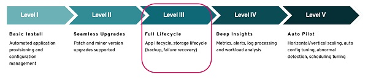
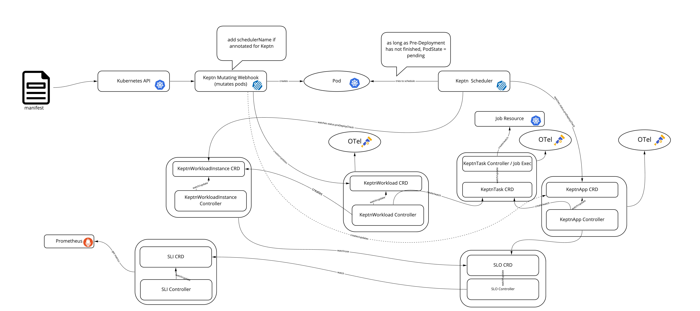

# Keptn Lifecycle Toolkit


[](https://github.com/keptn/lifecycle-toolkit/discussions)

The goal of this toolkit is to introduce a more “cloud-native” approach for pre- and post-deployment, as well as the
concept of application health checks.
It is an incubating project, under the umbrella of
the [Keptn Application Lifecycle working group](https://github.com/keptn/wg-app-lifecycle).

Status of the different features:

- 
  Observability: expose [OTel](https://opentelemetry.io/) metrics and traces of your deployment.
- 
  K8s Custom Metrics: expose your Observability platform via the [Custom Metric API](https://github.com/kubernetes/design-proposals-archive/blob/main/instrumentation/custom-metrics-api.md).
- 
  Release lifecycle: handle pre- and post-checks of your Application deployment.
- 
  Certificate Manager: automatically configure TLS certificates for
  [secure communication with the Kube API](https://kubernetes.io/docs/concepts/security/controlling-access/#transport-security).

<!---
alpha  )
beta  )
stable  )
-->

For more info about the features, please refer to our [documentation](./docs/content/en/docs/).

## Watch the KubeCon 2022 Detroit Demo

Click to watch it on YouTube:

[](https://www.youtube.com/watch?v=K-cvnZ8EtGc)

## Deploy the latest release

### Known Limitations

- Kubernetes >=1.24 is needed to deploy the Lifecycle Toolkit
- The Lifecycle Toolkit is currently not compatible with [vcluster](https://github.com/loft-sh/vcluster)

### Installation

Use the following command sequence to install the latest release of the Keptn Lifecycle Toolkit:

```shell
helm repo add klt https://charts.lifecycle.keptn.sh
helm repo update
helm upgrade --install keptn klt/klt -n keptn-lifecycle-toolkit-system --create-namespace --wait
```

For installing the Lifecycle Toolkit via manifests use:

<!---x-release-please-start-version-->

```shell
kubectl apply -f https://github.com/keptn/lifecycle-toolkit/releases/download/v0.7.1/manifest.yaml
```

<!---x-release-please-end-->

The Lifecycle Toolkit uses the OpenTelemetry collector to provide a vendor-agnostic implementation of how to receive,
process and export telemetry data.
To install it, follow
their [installation instructions](https://opentelemetry.io/docs/collector/getting-started/).
We provide some information about this in our [observability example](./examples/support/observability/).

The Lifecycle Toolkit includes a Mutating Webhook which requires TLS certificates to be mounted as a volume in its pod.
The certificate creation
is handled automatically
by [klt-cert-manager](https://github.com/keptn/lifecycle-toolkit/blob/main/klt-cert-manager/README.md).
Versions 0.6.0
and earlier have a hard dependency on the [cert-manager](https://cert-manager.io).
See [installation guideline](https://github.com/keptn/lifecycle-toolkit/blob/main/docs/content/en/docs/snippets/tasks/install.md)
for more info.

## Goals

The Keptn Lifecycle Toolkit aims to support Cloud Native teams with:

- Pre-requisite evaluation before deploying workloads and applications
- Finding out when an application (not workload) is ready and working
- Checking the Application Health in a declarative (cloud-native) way
- Standardized way for pre- and post-deployment tasks
- Provide out-of-the-box Observability of the deployment cycle



The Keptn Lifecycle Toolkit could be seen as a general purpose and
declarative [Level 3 operator](https://operatorframework.io/operator-capabilities/) for your Application.
For this reason, the Keptn Lifecycle Toolkit is agnostic to deployment tools that are used and works with any GitOps
solution.

## How to use

The Keptn Lifecycle Toolkit monitors manifests that have been applied against the Kubernetes API and reacts if it finds
a workload with special annotations/labels.
For this, you should annotate your [Workload](https://kubernetes.io/docs/concepts/workloads/) with (at least) the
following annotations:

```yaml
keptn.sh/app: myAwesomeAppName
keptn.sh/workload: myAwesomeWorkload
keptn.sh/version: myAwesomeWorkloadVersion
```

Alternatively, you can use
Kubernetes [Recommended Labels](https://kubernetes.io/docs/concepts/overview/working-with-objects/common-labels/) to
annotate your workload:

```yaml
app.kubernetes.io/part-of: myAwesomeAppName
app.kubernetes.io/name: myAwesomeWorkload
app.kubernetes.io/version: myAwesomeWorkloadVersion
```

In general, the Keptn Annotations/Labels take precedence over the Kubernetes recommended labels.
If there is no version
annotation/label and there is only one container in the pod, the Lifecycle Toolkit will take the image tag as version (
if it is not "latest").

In case you want to run pre- and post-deployment checks, further annotations are necessary:

```yaml
keptn.sh/pre-deployment-tasks: verify-infrastructure-problems
keptn.sh/post-deployment-tasks: slack-notification,performance-test
```

The value of these annotations are
Keptn [CRDs](https://kubernetes.io/docs/concepts/extend-kubernetes/api-extension/custom-resources/)
called [KeptnTaskDefinition](#keptntaskdefinition)s.
These CRDs contains re-usable "functions" that can
executed before and after the deployment.
In this example, before the deployment starts, a check for open problems in
your infrastructure
is performed.
If everything is fine, the deployment continues and afterward, a slack notification is sent with the
result of
the deployment and a pipeline to run performance tests is invoked.
Otherwise, the deployment is kept in a pending state
until
the infrastructure is capable to accept deployments again.

A more comprehensive example can be found in our [examples folder](./examples/sample-app/) where we
use [Podtato-Head](https://github.com/podtato-head/podtato-head) to run some simple pre-deployment checks.

To run the example, use the following commands:

```bash
cd ./examples/podtatohead-deployment/
kubectl apply -f .
```

Afterward, you can monitor the status of the deployment using

```bash
kubectl get keptnworkloadinstance -n podtato-kubectl -w
```

The deployment for a Workload will stay in a `Pending` state until the respective pre-deployment check is completed.
Afterward, the deployment will start and when it is `Succeeded`, the post-deployment checks will start.

## Architecture

The Keptn Lifecycle Toolkit is composed of the following components:

- Keptn Lifecycle Operator
- Keptn Scheduler

The Keptn Lifecycle Operator contains several controllers for Keptn CRDs and a Mutating Webhook.
The Keptn Scheduler ensures that Pods are started only after the pre-deployment checks have finished.

A Kubernetes Manifest, which is annotated with Keptn specific annotations, gets applied to the Kubernetes Cluster.
Afterward, the Keptn Scheduler gets injected (via Mutating Webhook), and Kubernetes Events for Pre-Deployment are sent
to the event stream.
The Event Controller watches for events and triggers a Kubernetes Job to fullfil the Pre-Deployment.
After the Pre-Deployment has finished, the Keptn Scheduler schedules the Pod to be deployed.
The KeptnApp and KeptnWorkload Controllers watch for the workload resources to finish and then generate a
Post-Deployment Event.
After the Post-Deployment checks, SLOs can be validated using an interface for retrieving SLI data from a provider,
e.g, [Prometheus](https://prometheus.io/).
Finally, Keptn Lifecycle Toolkit exposes Metrics and Traces of the whole Deployment cycle
with [OpenTelemetry](https://opentelemetry.io/).



## How it works

The following sections will provide insights on each component of the Keptn Lifecycle Toolkit in terms of their purpose,
responsibility, and communication with other components.
Furthermore, there will be a description on what CRD they monitor and a general overview of their fields.

### Webhook

Annotating a namespace subjects it to the effects of the mutating webhook:

```yaml
apiVersion: v1
kind: Namespace
metadata:
  name: podtato-kubectl
  annotations:
    keptn.sh/lifecycle-toolkit: "enabled"  # this lines tells the webhook to handle the namespace
```

However, the mutating webhook will modify only resources in the annotated namespace that have Keptn annotations.
When the webhook receives a request for a new pod, it will look for the workload annotations:

```yaml
keptn.sh/workload: "some-workload-name"
```

The mutation consists in gating the deployment or pod so that the kubernetes Scheduler will not yet deploy them.
Webhook then creates a
workload and app resource per annotated resource.
You can also specify a custom app definition with the annotation:

```yaml
keptn.sh/app: "your-app-name"
```

In this case the webhook will not generate an app, but it will expect that the user will provide one.
The webhook should be as fast as possible and should not create/change any resource.
Additionally, it will compute a version string, using a hash function that takes certain properties of the pod as
parameters
(e.g. the images of its containers).
Next, it will look for an existing instance of a `Workload CRD` for the given workload name:

- If it finds the `Workload`, it will update its version according to the previously computed version string.
  In addition, it will include a reference to the ReplicaSet UID of the pod (i.e. the Pods owner),
  or the pod itself, if it does not have an owner.
- If it does not find a workload instance, it will create one containing the previously computed version string.
  In addition, it will include a reference to the ReplicaSet UID of the pod (i.e. the Pods owner), or the pod itself, if
  it does not have an owner.

It will use the following annotations for
the specification of the pre/post deployment checks that should be executed for the `Workload`:

- `keptn.sh/pre-deployment-tasks: task1,task2`
- `keptn.sh/post-deployment-tasks: task1,task2`

and for the Evaluations:

- `keptn.sh/pre-deployment-evaluations: my-evaluation-definition`
- `keptn.sh/post-deployment-evaluations: my-eval-definition`

After either one of those actions has been taken, the webhook will set the scheduler of the pod and allow the pod to be
scheduled.

### Scheduler ##TODO

After the Webhook mutation, the Keptn-Scheduler will handle the annotated resources.
The scheduling flow follows the
default scheduler behavior,
since it implements a scheduler plugin based on
the [scheduling framework]( https://kubernetes.io/docs/concepts/scheduling-eviction/scheduling-framework/).
For each pod, at the very end of the scheduling cycle, the plugin verifies whether the pre deployment checks have
terminated, by retrieving the current status of the WorkloadInstance.
Only if that is successful, the pod is bound to a
node.

### KeptnApp

An App contains information about all workloads and checks associated with an application.
It will use the following structure for the specification of the pre/post deployment and pre/post evaluations checks
that should be executed at app level:

```yaml
apiVersion: lifecycle.keptn.sh/v1alpha3
kind: KeptnApp
metadata:
  name: podtato-head
  namespace: podtato-kubectl
spec:
  version: "1.3"
  revision: 1
  workloads:
    - name: podtato-head-left-arm
      version: 0.1.0
    - name: podtato-head-left-leg
      version: 1.2.3
  preDeploymentTasks:
    - pre-deployment-hello
  postDeploymentTasks:
    - post-deployment-hello
  preDeploymentEvaluations:
    - my-prometheus-definition
  postDeploymentEvaluations:
    - my-prometheus-definition
```

While changes in the workload version will affect only workload checks, a change in the app version will also cause a
new execution of app level checks.

### KeptnWorkload

A Workload contains information about which tasks should be performed during the `preDeployment` as well as
the `postDeployment`
phase of a deployment.
In its state it keeps track of the currently active `Workload Instances`, which are responsible
for doing those checks for
a particular instance of a Deployment/StatefulSet/ReplicaSet (e.g. a Deployment of a certain version).

### KeptnWorkloadInstance

A Workload Instance is responsible for executing the pre- and post deployment checks of a workload.
In its state, it
keeps track of the current status of all checks, as well as the overall state of
the Pre Deployment phase, which can be used by the scheduler to tell that a pod can be allowed to be placed on a node.
Workload Instances have a reference to the respective Deployment/StatefulSet/ReplicaSet, to check if it has reached the
desired state.
If it detects that the referenced object has reached
its desired state (e.g. all pods of a deployment are up and running), it will be able to tell that
a `PostDeploymentCheck` can be triggered.

### KeptnTaskDefinition

A `KeptnTaskDefinition` is a CRD used to define tasks that can be run by the Keptn Lifecycle Toolkit
as part of pre- and post-deployment phases of a deployment.
`KeptnTaskDefinition` resource can be created in the namespace where the application is running, or
in the default KLT namespace, which will be the fallback option for the system to search.
The task definition is a [Deno](https://deno.land/) script
Please, refer to the [function runtime](./functions-runtime/) folder for more information about the runtime.
In the future, we also intend to support other runtimes, especially running a container image directly.

A task definition can be configured in three different ways:

- inline
- referring to an HTTP script
- referring to another `KeptnTaskDefinition`

An inline KeptnTaskDefinition looks like the following:

```yaml
apiVersion: lifecycle.keptn.sh/v1alpha3
kind: KeptnTaskDefinition
metadata:
  name: deployment-hello
spec:
  function:
    inline:
      code: |
        console.log("Deployment Task has been executed");
```

In the code section, it is possible to define a full-fletched Deno script.
A further example, is available [here](./examples/taskonly-hello-keptn/inline/taskdefinition.yaml).

To runtime can also fetch the script on the fly from a remote webserver.
For this, the CRD should look like the
following:

```yaml
apiVersion: lifecycle.keptn.sh/v1alpha3
kind: KeptnTaskDefinition
metadata:
  name: hello-keptn-http
spec:
  function:
    httpRef:
      url: <url>
```

An example is available [here](./examples/taskonly-hello-keptn/http/taskdefinition.yaml).

Finally, `KeptnTaskDefinition` can build on top of other `KeptnTaskDefinition`s.
This is a common use case where a general function can be re-used in multiple places with different parameters.

```yaml
apiVersion: lifecycle.keptn.sh/v1alpha3
kind: KeptnTaskDefinition
metadata:
  name: slack-notification-dev
spec:
  function:
    functionRef:
      name: slack-notification
    parameters:
      map:
        textMessage: "This is my configuration"
    secureParameters:
      secret: slack-token
```

As you might have noticed, Task Definitions also have the possibility to use input parameters.
The Lifecycle Toolkit passes the values defined inside the `map` field as a JSON object.
At the moment, multi-level maps are not supported.
The JSON object can be read through the environment variable `DATA` using `Deno.env.get("DATA");`.
K8s secrets can also be passed to the function using the `secureParameters` field.
Here, the `secret` value is the K8s secret name that will be mounted into the runtime and made available to the function
via the environment variable `SECURE_DATA`.

### KeptnTask

A Task is responsible for executing the TaskDefinition of a workload.
The execution is done spawning a K8s Job to handle a single Task.
In its state, it keeps track of the current status of the K8s Job created.

### KeptnEvaluationDefinition

A `KeptnEvaluationDefinition` is a CRD used to define evaluation tasks that can be run by the Keptn Lifecycle Toolkit
as part of pre- and post-analysis phases of a workload or application.
`KeptnEvaluationDefinition` resource can be created in the namespace where the application is running, or
in the default KLT namespace, which will be the fallback option for the system to search.

A KeptnEvaluationDefinition looks like the following:

```yaml
apiVersion: lifecycle.keptn.sh/v1alpha3
kind: KeptnEvaluationDefinition
metadata:
  name: my-prometheus-evaluation
spec:
  objectives:
    - keptnMetricRef:
        name: cpu
        namespace: ns
      evaluationTarget: <20
    - keptnMetricRef:
        name: memory
        namespace: ns
      evaluationTarget: >4
```

### KeptnMetricsProvider

A `KeptnMetricsProvider` CRD defines the evaluation provider that provides data for the
pre- and post-analysis phases of a Keptn workload or Keptn application.

A KeptnMetricsProvider definition looks like the following:

```yaml
apiVersion: metrics.keptn.sh/v1alpha2
kind: KeptnMetricsProvider
metadata:
  name: prometheus
spec:
  targetServer: "http://prometheus-k8s.monitoring.svc.cluster.local:9090"
  secretKeyRef:
    key: prometheusLoginCredentials
```

> **Note**
The KeptnMetricsProvider is a new resource in KLT 0.7.0.
The [migration documentation](./docs/content/en/docs/tasks/migrate-keptnevaluationprovider/_index.md)
provides information about how to upgrade from 0.6.0 and earlier versions to 0.7.0.

### KeptnMetric

A `KeptnMetric` CRD defines the SLI provider with a query and stores metric data fetched from the provider.
Providing the metrics as CRD into a Kubernetes cluster makes this data reusable across multiple projects or workloads.
Furthermore, this allows using multiple observability platforms for different metrics.

A KeptnMetric definition looks like the following:

```yaml
apiVersion: metrics.keptn.sh/v1alpha2
kind: KeptnMetric
metadata:
  name: keptnmetric-sample
  namespace: keptn-lifecycle-toolkit-system
spec:
  provider:
    name: "prometheus"
  query: "sum(kube_pod_container_resource_limits{resource='cpu'})"
  fetchIntervalSeconds: 5
```

To use `KeptnMetric` as part of your evaluation, you must set the
`.spec.objectives[i].keptnMetricRef.name` and `.spec.objectives[i].keptnMetricRef.namespace` of
`KeptnEvaluationDefiniton` resource to the same value that is stored in `.metadata.name` and `metadata.namespace`
of the `KeptnMetric` resource.
Specifying the `.spec.objectives[i].keptnMetricRef.namespace` is optional.
If it's not specified, KLT searches for the `KeptnMetric` resource in the namespace where `KeptnEvaluationDefinition`
resource is stored.
If the `KeptnMetric` resource cannot be found there, it searches in the default KLT namespace (`keptn-lifecycle-toolkit-system`).

> **Note**
Please be aware that, if
 the `.spec.objectives[i].keptnMetricRef.namespace` of `KeptnEvaluationDefinition`
resource is specified and the `KeptnMetric` resource does not exist in this namespace, the evaluation fails.

### Keptn Config

The `KeptnConfig` is a CRD defines configuration values for the Keptn Lifecycle Toolkit.
Currently, it can be used to configure the URL of the OpenTelemetry collector.
Additionally, it can be used to set the time interval in which automatic app discovery
searches for workloads to put into the same auto-generated `KeptnApp`.
When the parameter is not set, the default value is 30 seconds.

A `KeptnConfig` looks like the following:

```yaml
apiVersion: options.keptn.sh/v1alpha1
kind: KeptnConfig
metadata:
  name: keptnconfig-sample
spec:
  OTelCollectorUrl: 'otel-collector:4317'
  keptnAppCreationRequestTimeoutSeconds: 30
```

## Install a dev build

The [GitHub CLI](https://cli.github.com/) can be used to download the manifests of the latest CI build.

```bash
gh run list --repo keptn/lifecycle-toolkit # find the id of a run
gh run download 3152895000 --repo keptn/lifecycle-toolkit # download the artifacts
kubectl apply -f ./keptn-lifecycle-operator-manifest/release.yaml # install the operators
```

Instead, if you want to build and deploy the operator into your cluster directly from the code, you can type:

```bash
RELEASE_REGISTRY=<YOUR_DOCKER_REGISTRY>
# (optional)ARCH=<amd64(default)|arm64v8>
# (optional)CHART_APPVERSION=<YOUR_PREFERRED_TAG (defaulting to current time)>

# Build and deploy the dev images to the current kubernetes cluster
make build-deploy-dev-environment

```

## License

Please find more information in the [LICENSE](LICENSE) file.

## Thanks to all the people who have contributed 💜

<!-- markdownlint-disable-next-line MD033 -->
<a href="https://github.com/keptn/lifecycle-toolkit/graphs/contributors">
<!-- markdownlint-disable-next-line MD033 -->
  
</a>

Made with [contrib.rocks](https://contrib.rocks).

<!-- markdownlint-disable-next-line MD033 MD013 -->

