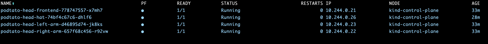
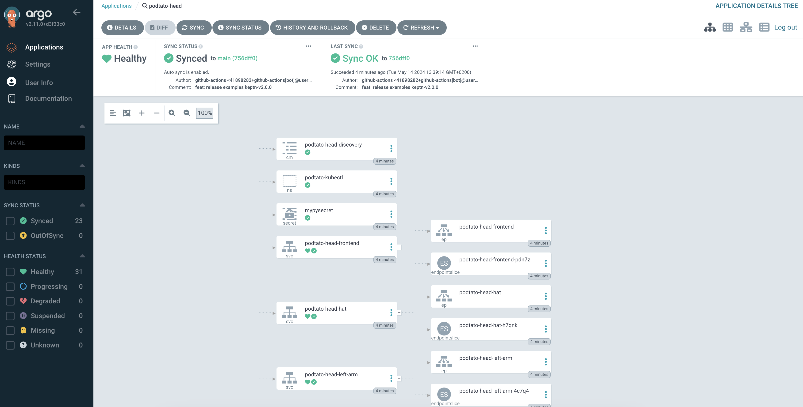
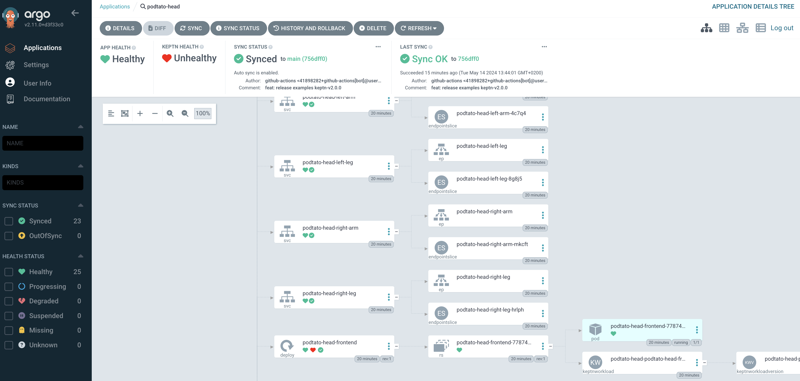
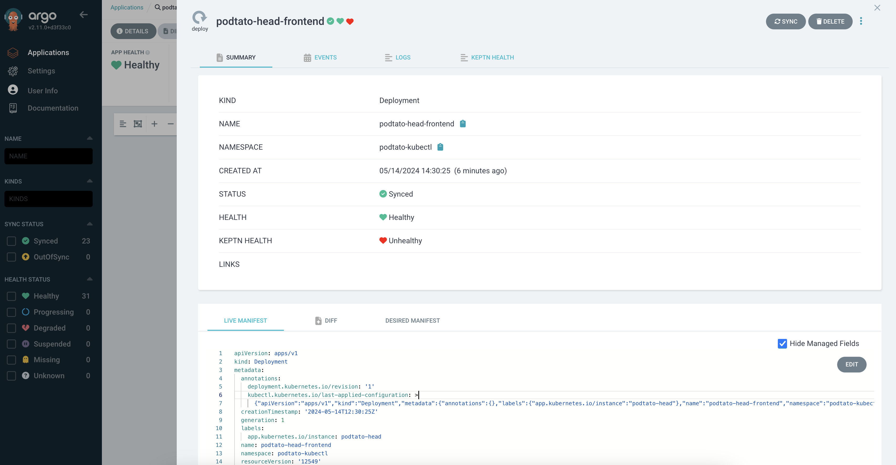

# Application health checks with Keptn using ArgoCD

In this blog post we will present a planned Keptn and
[ArgoCD](https://argo-cd.readthedocs.io/en/stable/) integration to execute
advanced application health checks using Keptn, where the application itself is deployed
by ArgoCD and display the Keptn application health status via ArgoCD UI.

Keptn provides an effective way to perform application health checks using the
pre- or post-deployment [tasks](https://keptn.sh/stable/docs/guides/tasks/)
and [evaluations](https://keptn.sh/stable/docs/guides/evaluations/).
Compared to ArgoCD application
health checks, which are evaluating if the application is successfully deployed
and the workloads are running on the cluster, they do not show if the microservices
of a single application are actually working as expected.
For example, it could be the case that the individual services deployed by ArgoCD are up and
running, but due to a slow `response time` (let's say `3s`) they are unable to communicate with each other.
Keptn pre- and post-deployment tasks and evaluations complement the missing functionality
by providing a straight-forward way to examine the application ability to perform
actions for which it was developed to do.
In this particular case, Keptn can perform `KeptnEvaluations` to examine, if the `response time`
of the application microservices are in the expected boundaries.

<!-- more -->

## How it's going to work?

Keptn and ArgoCD need to be installed and enabled on the same
cluster.
To install both components, you can follow the
[Keptn installation instructions](https://keptn.sh/stable/docs/installation/)
as well as
[ArgoCD installation instructions](https://argo-cd.readthedocs.io/en/stable/operator-manual/installation/).
The reason is that we want to have ArgoCD perform the actual deployment
of the application and Keptn executing the advanced application health checks.

Additionally, we will need to have an ArgoCD extension, which will consist of
a React application extending the ArgoCD UI, implemented as
[ArgoCD UI Application Tab Extension](https://argo-cd.readthedocs.io/en/stable/developer-guide/extensions/ui-extensions/#application-tab-extensions)
and a proxy allowing Keptn (which will work as a backend service)
to push the application health status data to the ArgoCD UI.
For proxy setup, the
[ArgoCD proxy extension](https://argo-cd.readthedocs.io/en/stable/developer-guide/extensions/proxy-extensions/)
will be used.

## What's the added value of Keptn?

Let's try to show a real-life example of an application deployed via ArgoCD,
which has a healthy green status in ArgoCD UI, but it's not working as expected
due to a slow `response time` of the application.

We will deploy a simple `podtato-head` application, which consists of multiple
Deployments and Services via ArgoCD.
The Argo Application deploying the manifests can look like the following:

```yaml

```

After a few moments, the `podtato-head` application is successfully deployed and all pods
are running.



We can also examine the ArgoCD UI and everything seems to be working as expected and the
`podtato-head` application is healthy.



Let's now try to add some health checks of the `podtato-head` application
and use Keptn to execute them.
For this, we are going to use the
[Keptn Release Lifecycle Management](https://keptn.sh/stable/docs/getting-started/lifecycle-management/)
feature and perform the checks via `KeptnEvaluations`.
For this example, we assume that you already have a metrics provider deployed
and configured on your cluster, which is able to fetch the `response time` values
of the microservices.
In our setup, we are going to use [Prometheus](https://prometheus.io/).

First, we need to create [KeptnMetric](https://keptn.sh/stable/docs/reference/crd-reference/metric/)
and [KeptnMetricsProvider](https://keptn.sh/stable/docs/reference/crd-reference/metricsprovider/)
resources in our cluster.
Thes two resources contain a simple query for fetching `response time` of the `podtato-head`
application microservice as well as configuration for the metrics provider supplying the data.

```yaml

```

Next, we add `KeptnEvaluationDefinition` into our git repository, where our
`podtato-head` application lives.
It defines the [SLO](https://www.dynatrace.com/news/blog/what-are-slos/)
by linking the existing `KeptnMetric` resource and providing the rule the value should fullfil.

```yaml

```

Additionally, we annotate the `podtato-head-frontend` Deployment to execute
the task as part of `post-deployment-evaluation` checks.

```yaml

```

After these two changes are made in our git repository, ArgoCD will see changes and re-trigger deployment
of `podtato-head` application.
Keptn waits until all of the
application pods are running and afterwards, it executes `post-deployment-evaluation` tasks.

Due to slow `response time` of the `podtato-head-frontend` microservice, the
executed `KeptnEvaluation` fails.

Here we can see that with the use of Keptn we can perform more advanced health checks
(tasks or evaluations) and verify that the application is healthy during the process
of deployment which is performed by ArgoCD.
Similarly to `KeptnEvaluations`, `KeptnTasks` can be executed as part of a quality health check
for our application.

## How to show Keptn health status in ArgoCD UI?

Using Keptn together with ArgoCD brings a lot of value, which we saw in the previous section,
but observing application health status by inspecting the status of the
various resources using `kubectl` is not the best user experience.
The data should be nicely displayed in the ArgoCD UI to provide the user with an overview
if the application was deployed, if it's synchronized and if it's healthy, all in
one place.

Due to this reason, we are going to implement an ArgoCD UI extension with additional application health
data, which are retrieved from Keptn.
This way, the ArgoCD UI will act as a single source of truth for the user providing all
the information about the deployed application.

Below you can see the first mockups how the extension of ArgoCD UI might look like
and how a failed `KeptnEvaluation` and therefore unhealthy Keptn status of `podtato-head-frontend`
Deployment might be displayed on the main ArgoCD UI screen.



Additionally, it should be possible to examine also the details of the unhealthy
microservice and potentially see the reason of the failure of the checks.



## Summary

Time to sum up what we have learned in this blog post.
We have seen how Keptn can easily complement ArgoCD
and enhance its functionality by providing more insights into
application health status.
We showed an example where ArgoCD wasn't able to detect that
the deployed application is not healthy and used `KeptnEvaluations`
for performing more advanced checks.
In the end, we looked at the first drafts of the potential
ArgoCD UI extension and how it can easily display the
`Keptn health status` as part of the standard ArgoCD application
health status.

We hope that this blog post gives you an idea and some inspiration
on how these two projects can cooperate and complement each other
effectively in order to support continuous delivery of applications
more reliable and faster.

We would really appreciate if you can provide us feedback on this
feature below in the comments!

## Useful links

- <https://keptn.sh>
- <https://argo-cd.readthedocs.io/en/stable/>
- <https://prometheus.io/>
