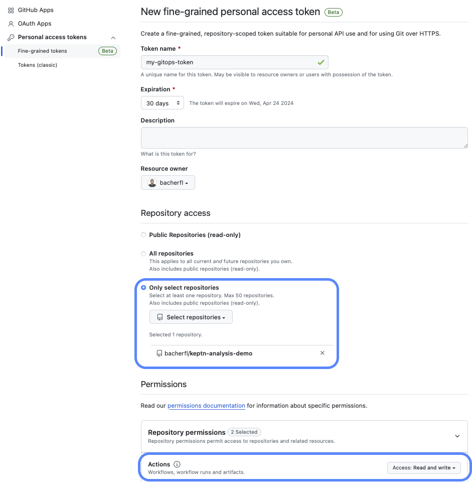
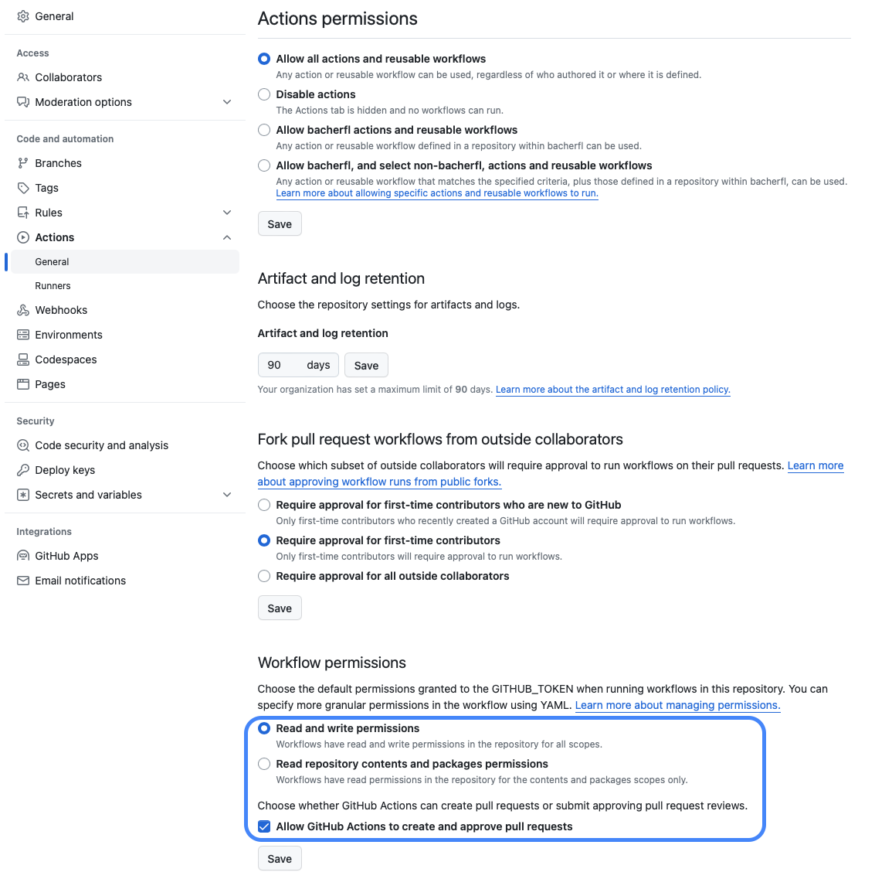
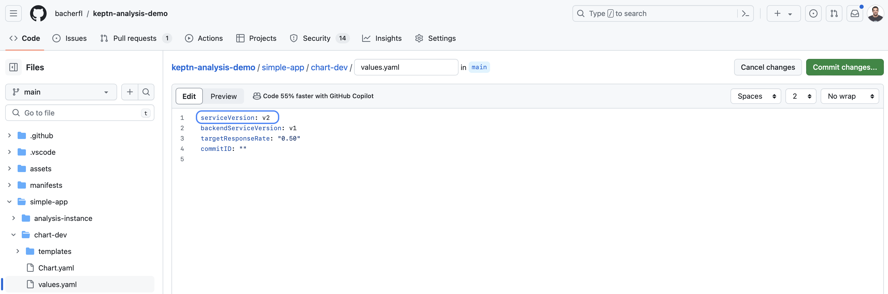
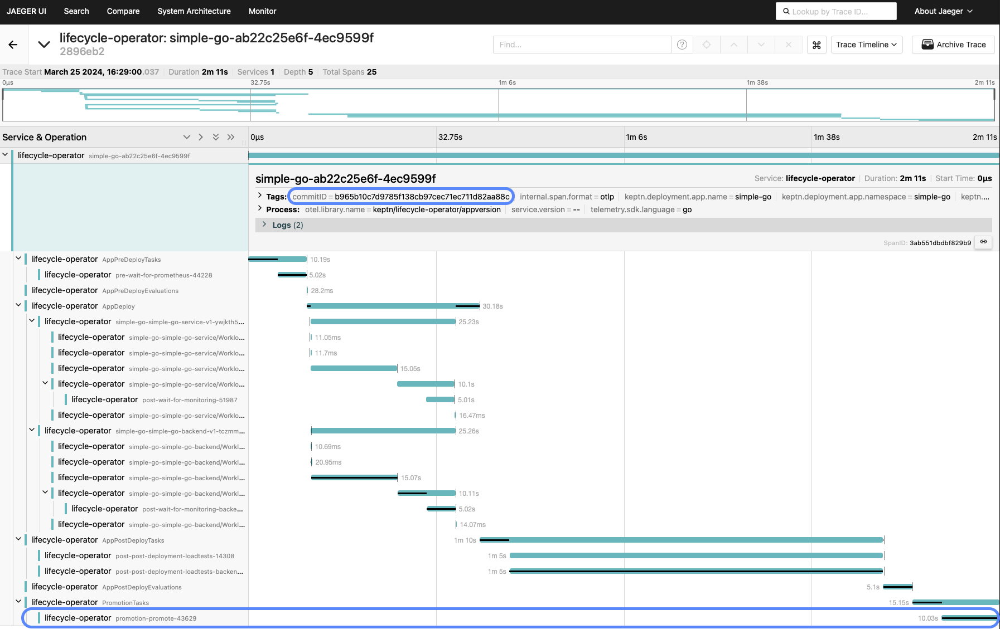
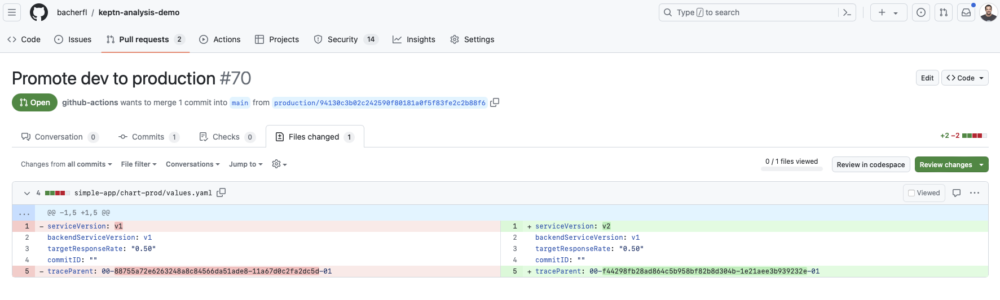
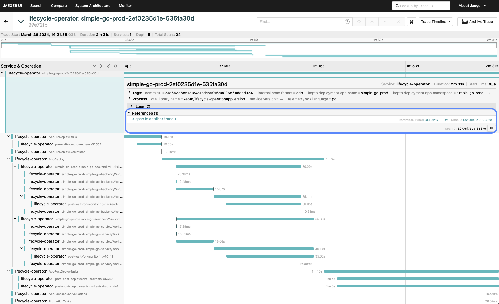

# Multi Stage Delivery using GitOps

In multi-stage environments it can often become a challenge to keep an overview of
how a particular version of a workload progresses through different stages.
This can make it difficult to trace back which exact introduced a problem
when something goes wrong in one of the deployment stages.

Having a distributed OpenTelemetry trace that encompasses all
deployment stages and contains all relevant information,
such as the git commit ID that triggered the deployment of a workload,
helps to address this challenge.
For example, if the evaluation of a load test in one of the deployment stages
is failing, the distributed trace generated by Keptn not only contains
details about the result of the evaluation, but also a link to the
deployment trace of the previous stage.
This makes it easy to trace back the deployment of that particular workload
across the previous stages, right until the original commit that resulted in
the performance degradation.

This blog post demonstrates an example workflow that automates the promotion
of a sample application across two different stages.
The deployment traces of those stages are linked together and enriched
with valuable metadata, such as the commit ID that triggered the deployment
of a new workload version.

For this, we are using the following technologies:

- The new [KeptnAppContext CRD](../../docs/reference/crd-reference/appcontext.md)
  that allows to pass metadata to the generated deployment traces, and define a `promotion`
  task that is executed once the application is deployed and all post deployment checks have been
  executed successfully.
- [ArgoCD](https://argoproj.github.io/cd/) as a GitOps tool.
  In addition to automatically synchronising the cluster with the desired
  state of the cluster, ArgoCD also adds metadata such as the git commit ID
  that triggered the last sync to the `KeptnAppContext` CRD.
- [GitHub Actions](https://github.com/features/actions): With the GitOps
  repository being hosted on GitHub, we are making use of GitHub Actions
  to implement the promotion of an artifact from one stage to the next by
  running a workflow that creates the pull requests for updating the
  application manifests in the different stages.
- [Helm](https://helm.sh): The configuration of the application in both stages
  is maintained via two separate helm charts respectively.
- [OpenTelemetry Collector](https://opentelemetry.io/docs/collector/)/[Jaeger](https://www.jaegertracing.io):
  The deployment traces are gathered by the OpenTelemetry Collector and forwarded to Jaeger,
  where we can view the generated traces.
- [Prometheus](https://prometheus.io): Provides monitoring data for the application.

Note that for this blog post, we are assuming that these tools are already
installed on the Kubernetes cluster, as going through the installation
of each of those would exceed the scope of this blog post.

## Setting up the Environment

Now it's time to set up our environment and connect all the tools mentioned above
with each other.

### Set up the GitHub repository

First things first, since we talk about GitOps in this article, we need
a git repository to host the helm chart of our application.
In this example, we are using GitHub, since this also allows us
to make use of GitHub Actions to implement the promotion from
`dev` to `production`.

In this example, we are using [this repository](https://github.com/bacherfl/keptn-analysis-demo)
as an upstream repository.
If you would like to try the demo yourself, feel free to fork this repository
and start experimenting with Keptn from there.

The first step in setting up the demo environment is to
create a personal access token for accessing the GitHub API.
This token will be used by the container running the promotion
task during the post-deployment phase of the `KeptnApp` within
the `dev` stage.
Using the access token, the container triggers a GitHub action
that creates a pull request to promote the version that has
been deployed in `dev` into `production`.
Using this GitHub actions-based approach instead of directly
interacting with the git repository in the container executing the promotion
step has the advantage of not having to grant the container any write permissions to the
repository.

Instead, an access token with a restricted set of permissions can be used,
se we can make use of GitHub's [fine-grained access tokens](https://github.blog/2022-10-18-introducing-fine-grained-personal-access-tokens-for-github/)
to restrict the permissions to only be able to trigger workflow actions,
exclusively within our GitOps repository.
The required permissions are highlighted in the screenshot below:



Another prerequisite to take care of is to enable GitHub workflows to write to the repo
and create pull requests.
This is done in the settings of the repository, see the screenshot below:



The GitHub action performing the promotion is implemented
in the following file, located in `.github/workflows/promote.yaml`

```yaml title=".github/workflows/promote.yaml"

```

This action essentially copies over the `values.yaml` file from the
`dev` stage to the `prod` stage, to set the
service versions that should be

## Prepare the application namespaces

In this example, the application will be deployed in
two different namespaces, each representing a different
stage (`dev` and `prod`).
To create the namespaces, execute the following commands:

```shell
kubectl create namespace simple-go
kubectl annotate namespace simple-go keptn.sh/lifecycle-toolkit=enabled
kubectl create namespace simple-go-prod
kubectl annotate namespace simple-go-prod keptn.sh/lifecycle-toolkit=enabled
```

The promotion task that triggers the action to
create a pull request for promoting an application version
from `dev` to `production` will be executed in the `simple-go` namespace.
Therefore, we need to create a secret containing the GitHub personal
access token we created earlier, using the following command:

```shell
GH_REPO_OWNER=<YOUR_GITHUB_USER>
GH_REPO=<YOUR_GITHUB_REPO>
GH_API_TOKEN=<YOUR_GITHUB_TOKEN>
kubectl create secret generic github-token -n simple-go --from-literal=SECURE_DATA="{\"githubRepo\":\"${GH_REPO}\",\"githubRepoOwner\":\"${GH_REPO_OWNER}\",\"apiToken\":\"${GH_API_TOKEN}\"}"
```

## Prepare the ArgoCD applications

The next step is to
create the ArgoCD applications in our cluster.
Each stage of our application (`dev` `production`) is
represented by a separate ArgoCD application which points to
a helm chart for the respective stage.
The helm charts can be found in our [GitOps repository](https://github.com/bacherfl/keptn-analysis-demo)
in the following sub folders:

- `simple-app/chart-dev`: Contains the helm chart for the application in the `dev` stage
- `simple-app/chart-prod`: Contains the helm chart for the application in the `prod` stage

The ArgoCD applications are created by applying the following manifest:

```yaml title="argo-apps.yaml"

```

The manifest above contains the definition for the two ArgoCD
applications which both point to the helm charts mentioned earlier.
In addition to that, the `$ARGOCD_APP_REVISION` environment variable
is used to get access to the git commit ID that triggered
a new deployment of our applications.
This ID is passed through to the helm chart and is used by
Keptn to include this as metadata for a `KeptnApp` deployment.

After applying the file, using `kubectl apply -f argo-apps.yaml`,
ArgoCD begins to synchronize the state of the applications,
meaning that the helm charts for the applications are applied to the
cluster.
While this is happening, let's have a closer look at the actual
content of the helm charts.

Both charts contain two `Deployments/Services`
(`simple-go-service` and `simple-go-backend`), representing
the two `KeptnWorkloads` that are part of our `KeptnApp`.
Let's take the `simple-go-service` `Deployment` as an example
to see how we prepared it to be managed by Keptn:

```yaml

```

To correctly associate the `Deployment` to `KeptnWorkload`,
the following labels are set:

- `app.kubernetes.io/name`: The name of the `KeptnWorkload` that should be associated with the `Deployment`.
- `app.kubernetes.io/part-of`: The name of the `KeptnApp` containing the two workloads.
- `app.kubernetes.io/version`: The version for the related `KeptnWorkload`.

In addition to the labels which define the `KeptnWorkload`, we also use
the `keptn.sh/post-deployment-tasks` to define a post-deployment task for the
workload.
The task defined here (`wait-for-monitoring`) ensures the Prometheus
target for the workload is available, before proceeding with
the execution of the load tests of the overall application.

Another resource worth mentioning is the `KeptnAppContext`,
which looks as follows:

```yaml

```

This resource contains a list of pre- and post-deployment checks
for the complete application.
In the pre-deployment phase, the task `wait-for-monitoring`
ensures the Prometheus installation in our cluster is available.
If this is not the case, it would not be wise to deploy a new
version of the application, since we cannot observe the
performance metrics of our application.
Once all workloads have been deployed, the application enters the
post-deployment phase, in which load tests against the application are
executed.
After executing the load tests, a post-deployment evaluation is
performed, in which the response time of the deployed workloads
is evaluated.
Finally, if all checks have passed, the application proceeds into the
`promotion` phase.
This is the phase where the GitHub personal access token we created earlier
is used to trigger the GitHub action to promote the deployed version
into the next stage.
In addition to the pre-/post-deployment checks and the promotion task,
the `KeptnAppContext` also contains a `metadata` property that
passes the `commitID` made available by ArgoCD to the
application deployment.
This information is then added by Keptn as an attribute to the
OpenTelemetry traces created for the application deployment.

To configure the application, the `values.yaml`
file is used.
Within that file, the versions for the two workloads that
are part of the application are defined,
as well as the target response time for the evaluation
in the post-deployment phase.
Also, the git commit ID mentioned earlier is set here.
The git commit ID is empty by default, but is set automatically
by ArgoCD, using the `$ARGOCD_APP_REVISION` environment variable.

```yaml

```

The helm chart of the `prod` stage is rather similar to the one
for the `dev` stage, but differs in the `values.yaml`, and the
`KeptnAppContext`.
First, let's inspect the `values.yaml` in `prod`:

```yaml

```

This file contains an additional property called `traceParent`,
which is essential in linking the deployment traces of the
`prod` stage to the previous stage, i.e. the `dev` stage.
The `traceParent` is propagated from Keptn to the GitHub action that
does the promotion by adapting the `values.yaml` file to
specify the workload versions that should be deployed in `prod`.
In our example, the value of the `traceParent` is the span ID of the
`promotion` phase of the `dev` stage.
To pass this property to Keptn, the `spanLinks` property of the `KeptnAppContext`
below is used:

```yaml

```

This causes the OpenTelemetry deployment trace in `prod` to have a reference
to the `promotion` phase in `dev`, indicating that the successful deployment
of the application in `dev` is what caused the deployment in `prod`.

## Promotion flow from `dev` to `prod`

Now that the GitOps repository and the ArgoCD application are set up,
let's have a closer look at how a new service version would make its way
into `dev` and then into `prod`.
To do this, the `values.yaml` file for the `dev` stage is edited to
change th service version from `v1` to `v2`:



After this change is committed to the GitOps repository, ArgoCD
eventually starts to synchronize the application, and the new service
version is deployed to `dev`.
This is reflected by a new `KeptnAppVersion` being created by Keptn,
for which the pre-/post-deployment checks
and the evaluation that were mentioned earlier are executed.
After some time, the new version is up and running in `dev`
and the deployment trace for the new `KeptnAppVersion` is
visible in Jaeger:



As you can see, the generated trace also contains the commitID that triggered
the deployment (i.e. the commit in which the version was changed).
We also see that the `promotion` phase has been executed successfully, so let's
check our GitOps repository and inspect the automatically created pull request
to promote the version into the next stage:



As expected, the pull request updates the `values.yaml` file for the
`prod` stage to update the `serviceVersion` to the same value we just
deployed in `dev`.
In addition to that, the `traceParent` property is set to the
span ID of the `promotion` phase of the deployment in `dev`.

Once the PR is merged, Keptn will take care of deploying
the new version in the `prod` stage, and eventually
we will see the deployment trace for that stage in
Jaeger as well:



As we can see in the deployment trace, we also have the commitID that triggered
the deployment in that stage, just like we also had in `dev`, but
in addition to that the trace also contains a reference
to the span ID of the `promotion` phase in `dev`.
This ultimately allows us to trace back the deployment of a particular
service version across multiple stages, right to the commit that
introduced a change to the affected service.

## Conclusion

Time to wrap up what we have learned in this example.
We have seen how the `KeptnAppContext` resource
can be used to define pre-/post-deployment checks and to
pass important metadata - in our example, using ArgoCD,
the git commit ID that triggered a new deployment -
to be added as attributes to the deployment traces
generated by Keptn.
Then, to gain observability not only for an isolated stage,
but across multiple stages, the `spanLinks` property
of the `KeptnAppContext` was used to create references to
deployment traces of a previous stage when
promoting a new version of a service from one stage to the next.

We hope the example in this blog post gives you some inspiration
on how you could implement Keptn into your continuous delivery
workflow.
If you would like to try out Keptn and its capabilities yourself,
feel free to head over to the [Keptn docs](https://lifecycle.keptn.sh/docs/)
and follow the guides to [install Keptn](https://lifecycle.keptn.sh/docs/install/).
We also appreciate any feedback and are always happy to support you
with any questions you might have.
