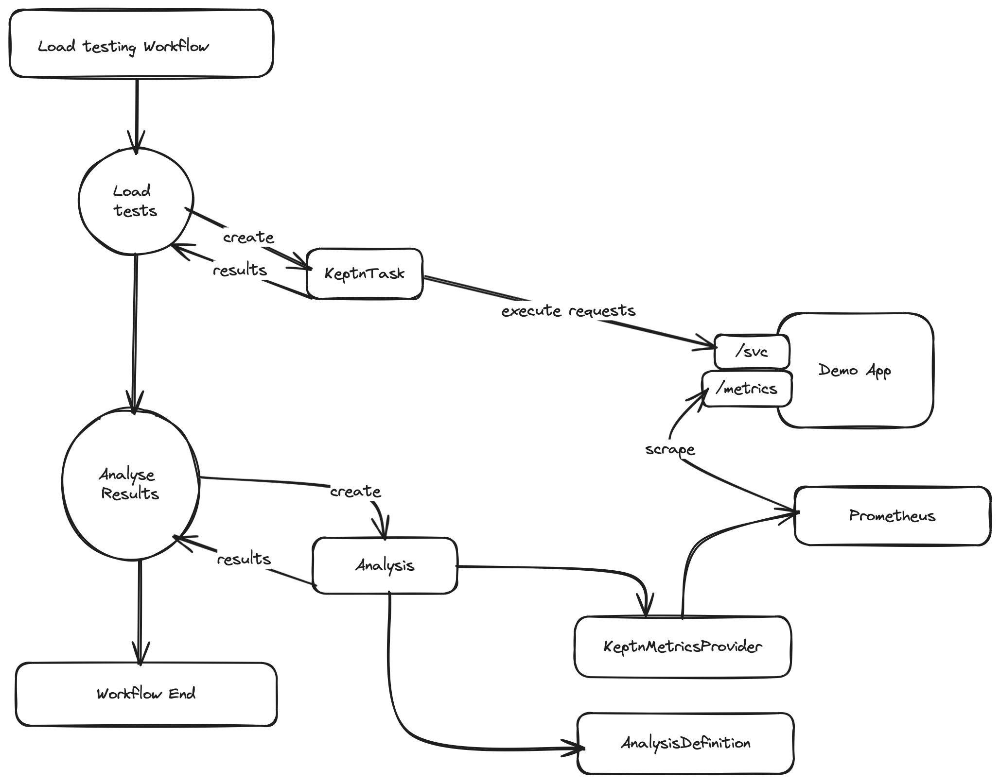
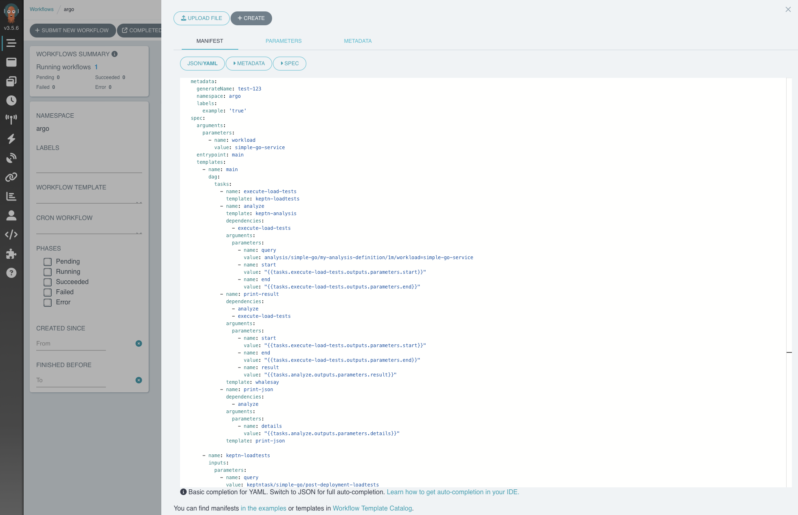
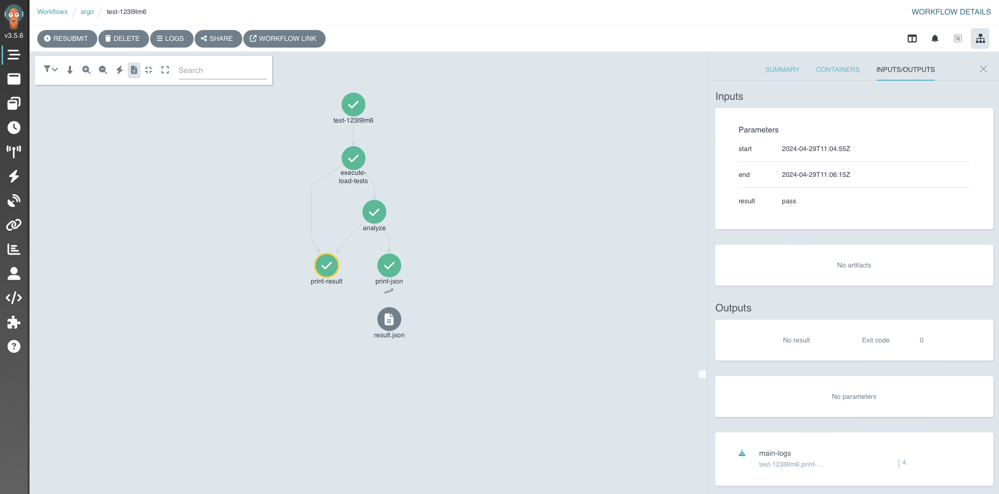

# Using Keptn Analyses in Argo Workflows

In this blog post we will explore how Keptn
can be used within [Argo Workflows](https://argoproj.github.io/workflows/) to
execute load tests using a [KeptnTask](../../docs/reference/crd-reference/task.md), and analyze their results
afterward using the [Keptn Analysis](../../docs/reference/crd-reference/analysis.md) feature.
Argo Workflows is a workflow orchestration engine built for Kubernetes, which makes it a perfect fit
to be used together with Keptn.
We will achieve this by using the support for [Executor Plugins](https://argo-workflows.readthedocs.io/en/latest/executor_plugins/)
provided by Argo Workflows.
This plugin mechanism is an easy way of integrating custom functionality into an Argo Workflow,
and providing further nodes in the workflow with valuable information, such as the outcome of a Keptn Analysis.

<!-- more -->

## Technologies used for this example

For this, we are using the following technologies:

- The [Keptn Analysis](../../docs/reference/crd-reference/analysis.md) resource
  defines goals for our metrics and evaluates them.
- [Argo Workflows](https://argoproj.github.io/workflows/) is the workflow engine.
- [Prometheus](https://prometheus.io): Provides monitoring data for the application.

## Architecture

The overall architecture of this example is depicted in the diagram below:



Our example workflow consists of two nodes, which do the following:

- The **Load Tests** node creates a `KeptnTask` that executes load tests against
a sample application.
Once the tests have finished, the results and the time frame of the `KeptnTask`
execution are reported back to Argo Workflows.
- The **Analyse Results** node takes the time frame of the executed load tests as an input parameter
and creates a Keptn `Analysis` for the given timeframe.
Using a `KeptnMetricsProvider` which retrieves the metrics for the application from Prometheus,
the metric values relevant for the analysis are retrieved and evaluated.
The result of the Analysis is then reported back to Argo Workflows which can then pass
on the Analysis results to other potential nodes in the workflow.

Both of the workflow nodes are executed using a simple Argo Workflow executor plugin
hosted in [this repo](https://github.com/bacherfl/argo-keptn-plugin).
Note, however, that the code in this repo is just a proof of concept and not
intended for use in production.

## Setting up the environment

In this example, we assume that both Keptn and Argo Workflows are
already installed on our cluster.
If this is not the case, and you would like to follow this example,
please follow the instructions at the respective installation guides:

- [Keptn Installation Guide](https://keptn.sh/stable/docs/installation/)
- [Argo Workflows Installation Guide](https://argo-workflows.readthedocs.io/en/latest/quick-start/)

The next step is to install the [Keptn extension for Argo Workflows (unofficial PoC implementation)](https://github.com/bacherfl/argo-keptn-plugin).
This is done by applying the `ConfigMap` that enables the plugin within Argo workflows,
and the required RBAC configuration for the plugin to be able to interact
with Keptn resources:

```shell
kubectl apply -f https://raw.githubusercontent.com/bacherfl/argo-keptn-plugin/main/config/keptn-executor-plugin-configmap.yaml
kubectl apply -f https://raw.githubusercontent.com/bacherfl/argo-keptn-plugin/main/config/rbac.yaml
```

## Defining the load test KeptnTaskDefinition

The load tests against our sample application are executed
using a `KeptnTask`.
The related `KeptnTaskDefinition` looks as follows:

```yaml

```

This task simply creates some load by sending a curl request
to the sample application for a duration of one minute.

## Defining the AnalysisValueTemplates

Now we are going to define the queries for the metrics we would like to analyse:

- The response time of the demo service
- The error rate of the demo service

Below are the `AnalysisValueTemplate` resources, as well as the
`KeptnMetricsProvider` resource that points to the Prometheus API
inside our cluster:

```yaml

```

Next, we define the `AnalysisDefinition` resource that contains the goals
for the metrics mentioned above:

```yaml

```

Note that the `AnalysisDefinition` used in this example is kept rather simple.
If you would like to learn more about the possibilities of the
analysis feature of Keptn, feel free to read more about it
in [this blog post](./application-performance-analysis.md).

## Putting it all together

Now that we have defined our Keptn resources for executing
load tests and analysing the performance of our application,
it is time to put everything together by defining the
Argo Workflow, which looks like the following:

```yaml

```

This workflow contains the following steps:

- **execute-load-tests:** Starts a new instance of a `KeptnTask` based on the `loadtests`
`KeptnTaskDefinition` we created earlier.
The result of this step contains the `start` and `end` timestamps of the executed load tests.
- **keptn-analysis:** Runs after the previous node is completed, and accepts the reported
`start` and `end` timestamps as input parameters.
This interval is used to create a new instance of an `Analysis` where the response time
and error rate during this interval is evaluated, using the `AnalysisDefinition` created earlier.
The overall result (i.e. whether the `Analysis` has passed or not), as well as a detailed breakdown
of each objective in JSON format is reported back to Argo in the results of the step.
- **print-result:** Takes both the `start` and `end` timestamps of the load tests, as well
as the overall `result` of the `Analysis` as input parameters, and prints a message containing
the result.
- **print-json**: Takes the JSON object containing the
analysis objective breakdown of the `keptn-analysis` as an input parameter,
and stores the received JSON object as an artifact.
This enables other nodes in a workflow to retrieve that artifact and use the information in it
as input artifacts.
Read more about the concept of artifacts in Argo Workflows [here](https://argo-workflows.readthedocs.io/en/latest/walk-through/artifacts/).

## Executing the workflow

The workflow is triggered by navigating to the Argo Workflows UI
and choosing the **Submit new Workflow** option:



After some time, all steps in the workflow are completed,
and both the time frame of the load test execution,
and the result of the `Analysis` are visible in
the Argo Workflows UI:



## Conclusion

In this article we have explored the potential of using Keptn
to both perform tasks and analyse performance metrics
within Argo Workflows, and pass the results on to the following steps.
Hopefully this article provides you with some inspiration of
how you can make use of Keptn within Argo Workflows -
If so, we would love to hear about it, and we always welcome any feedback.
If you have questions or run into any kind of issues,
feel free to reach out on the
[#Keptn CNCF Slack channel](https://cloud-native.slack.com/archives/C017GAX90GM)
or by raising issues in our
[GitHub repository](https://github.com/keptn/lifecycle-toolkit/issues).
