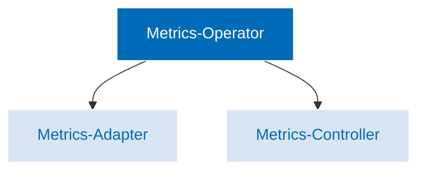

The Keptn Metrics Operator collects, processes, and analyzes metrics data from a variety of sources.
Once collected, this data, can be used to generate a variety of reports and dashboards
that provide insights into the health and performance of the application and infrastructure.

While Kubernetes does have two metrics servers, they have limitations.
The custom and external APIs only allow you to use a single observability platform.
The Keptn Metrics Operator solves this problem by providing a single entry point for
all your metrics data, regardless of its source.
Furthermore, due to the integration with the Kubernetes custom metrics API, these metrics are also
compatible with the Kubernetes HorizontalPodAutoscaler (HPA) which enables the horizontal scaling of workloads
based on metrics collected from multiple observability platforms such as Prometheus, Dynatrace or Datadog.

The Metrics Operator consists of the following components:

* Metrics Controller
* Metrics Adapter

**Metrics adapter** is used to expose custom metrics from an application to external monitoring and alerting tools.
The adapter exposes custom metrics on a specific endpoint where external monitoring and alerting tools can scrape them.
It is an important component of the metrics operator as it allows for the collection and exposure of custom metrics,
which can be used to gain insight into the behavior and performance of applications running on a Kubenetes cluster.

**Metrics controller** is used to fetch metrics from a SLI provider.
The controller reconciles a [`KeptnMetric`](../../../../yaml-crd-ref/metric.md) CR and
updates its status with the metric value provided by the selected SLI provider.
The steps in which the controller fetches metrics are given below:

* It first fetches the `KeptnMetric` object to reconcile.
* If the object is not found, it returns and lets Kubernetes handle deleting all associated resources.
* If the object is found, the code checks that if the metric has been updated within the configured
interval which is defined in the `Spec.FetchIntervalSeconds`.
If not, then it skips reconciling and requeues the request for later.
* If the metric should be reconciled, it fetches the provider defined in the `Spec.Provider.Name` field.
* If the provider is not found, it returns and requeues the request for later.
* If the provider is found, it loads the provider and evaluates the query defined in the `Spec.Query` field.
* If the evaluation is succesful, it stores the fetched value in the status of the `KeptnMetric` object.
