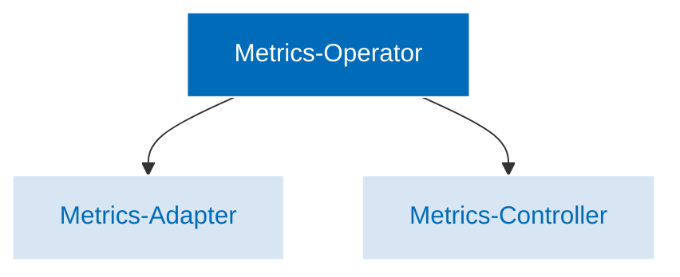

The Keptn Metrics Operator collects, processes,
and analyzes metrics data from a variety of sources.
Once collected, this data can be used
to generate a variety of reports and dashboards
that provide insights into the health and performance
of the application and infrastructure.

While Kubernetes has ways to extend its metrics APIs, they have limitations,
especially that they only allow you to use a single observability platform
such as Prometheus, Dynatrace or Datadog.
The Keptn Metrics Operator solves this problem
by providing a single entry point for
all your metrics data, regardless of its source,
so you can use multiple instances of multiple observability platforms.

Keptn metrics are integrated with the Kubernetes
[Custom Metrics API](https://github.com/kubernetes/metrics#custom-metrics-api),
so they are compatible with the Kubernetes
[HorizontalPodAutoscaler](https://kubernetes.io/docs/tasks/run-application/horizontal-pod-autoscale/)
(HPA), which enables the horizontal scaling of workloads
based on metrics collected from multiple observability platforms.
See
[Using the HorizontalPodAutoscaler](../../implementing/evaluatemetrics.md#using-the-horizontalpodautoscaler)
for instructions.

The Metrics Operator consists of the following components:

* Metrics Controller
* Metrics Adapter

The **Metrics adapter** exposes custom metrics from an application
to external monitoring and alerting tools.
The adapter exposes custom metrics on a specific endpoint
where external monitoring and alerting tools can scrape them.
It is an important component of the metrics operator
as it allows for the collection and exposure of custom metrics,
which can be used to gain insight into the behavior and performance
of applications running on a Kubernetes cluster.

The **Metrics controller** fetches metrics from an SLI provider.
The controller reconciles a [`KeptnMetric`](../../yaml-crd-ref/metric.md)
resource and updates its status with the metric value
provided by the selected metric provider.
Each `KeptnMetric` is identified by `name`
and is associated with an instance of an observability platform
that is defined in a
[KeptnMetricsProvider](../../yaml-crd-ref/metricsprovider.md)
resource.

The steps in which the controller fetches metrics are given below:

1. When a [`KeptnMetric`](../../yaml-crd-ref/metric.md)
   resource is found or modified,
   the controller checks whether the metric has been updated
   within the interval that is defined in the `spec.fetchintervalseconds` field.
   * If not, it skips the reconciliation process
     and queues the request for later.

1. The controller attempts to fetch the provider defined in the
   `spec.provider.name` field.
   * If this is not possible, the controller reconciles
     and queues the request for later.

1. If the provider is found,
   the controller loads the provider and evaluates the query
   defined in the `spec.query` field.
   * If the evaluation is successful,
     it stores the fetched value
     in the `status` field of the `KeptnMetric` object.
   * If the evaluation fails,
     the error and reason is written to the
     [KeptnMetricStatus](../../crd-ref/metrics/v1alpha3/#keptnmetricstatus)
     resource.
     The error is described in both human-readable language
     and as raw data to help identify the source of the problem
     (such as a forbidden code).
