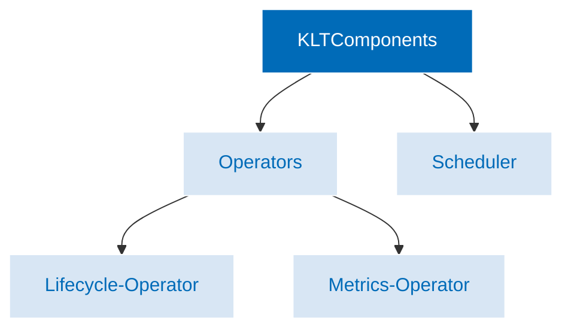

### Keptn Lifecycle Toolkit Components

The Keptn Lifecycle Toolkit consists of two main components:

* Keptn Lifecycle Operator, which splits into two separate operators
in Release 0.7.0 and later:
  * Lifecycle-Operator
  * Metrics-Operator
* Keptn Lifecycle Scheduler

