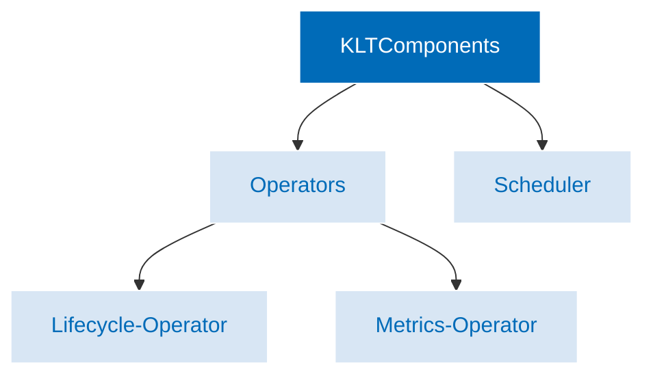

### Keptn Lifecycle Toolkit Components

The Keptn Lifecycle Toolkit consists of two main components:

* Keptn Lifecycle Operator, which splits into two separate operators
in Release 0.7.0 and later:
  * Lifecycle-Operator
  * Metrics-Operator
* Keptn Lifecycle Scheduler

**Keptn's Lifecycle Operator** is
a Kubernetes [operator](https://kubernetes.io/docs/concepts/extend-kubernetes/operator/)
that automates the deployment and management
of the Keptn Lifecycle Controller components in a Kubernetes cluster.
The Keptn Lifecycle Operator contains several controllers for **Keptn CRDs**
and a **Mutating Webhook**.

Here's a brief overview:

**Keptn CRDs:** Keptn Lifecycle Operator contains
several controllers that manage and reconcile different types of Keptn CRDs
such as the Project Controller, Service Controller, and Stage Controller.

**Mutating Webhook:** automatically injects Keptn labels
and annotations into Kubernetes resources,
such as deployments and services.
These labels and annotations are used to enable Keptn's automation
and monitoring capabilities.

**Keptn's Lifecycle Metrics Operator**
collects,  processes, and analyzes metrics data from a variety of sources.
Once collected, this data, can be used to generate a variety of reports
and dashboards that provide insights into the health and performance of the application and infrastructure.

**Keptn's Lifecycle Scheduler** replaces the
[Kubernetes scheduler](https://kubernetes.io/docs/concepts/scheduling-eviction/kube-scheduler/)
to allow users to schedule events and tasks to occur
at specific times during the application lifecycle.
The Lifecycle Scheduler can trigger events such as
deployment, testing, and remediation at specific times or intervals.
The Keptn Scheduler guarantees that Pods are initiated only after
the Pre-Deployment checks are completed.
