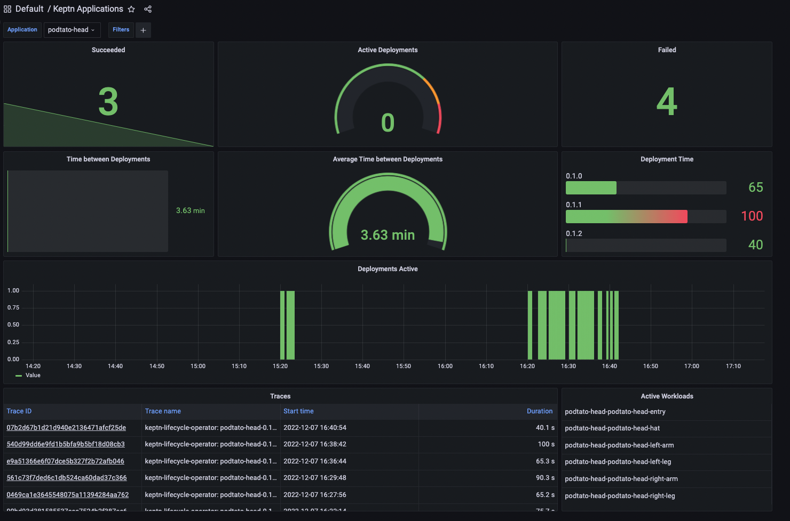

`kubectl create -f deployment.yaml` will "blindly" deploy workloads, but who needs to be notified that this deployment
is about to happen? Is your infrastructure ready? Do your downstream services meet their SLOs? Can your infrastructure
handle the deployment?

After the deployment, beyond the standard k8s probes, how can you integrate with other tooling to automatically test the
deployment? How do you know the deployment is meeting its SLOs? Has the deployment caused any issues downstream? Who
needs to know that the deployment was successful (or unsuccessful)?

The Keptn Lifecycle Toolkit (KLT) "wraps" a standard Kubernetes deployment and provides both workload (single service)
tests and SLO evaluations. Multiple workloads can also be logically grouped (and evaluated) as a single cohesive unit: a
Keptn Application. In other words, an application is a collection of multiple workloads.

The Keptn Lifecycle Toolkit is a tool and vendor-neutral mechanism - it does not depend on particular GitOps tooling -
ArgoCD, Flux, Gitlab or others - KLT works with them all.

The Keptn Lifecycle Toolkit emits signals at every stage (k8s events, OpenTelemetry metrics and traces) to ensure your
deployments are observable.

Available steps (applicable to both workload and application entities):

* Pre-Deployment Tasks: e.g. checking for dependant services, checking if the cluster is ready for the deployment, etc.
* Pre-Deployment Evaluations: e.g. evaluate metrics before your application gets deployed (e.g. layout of the cluster)
* Post-Deployment Tasks: e.g. trigger a test, trigger a deployment to another cluster, etc.
* Post-Deployment Evaluations: e.g. evaluate the deployment, evaluate the test results, etc.

## What you will learn here

* Use the Keptn Lifecycle Toolkit to control the deployment of your application
* Connect the lifecycle-toolkit to Prometheus
* Use pre-deployment tasks to check if a dependency is met before deploying a workload
* Use post-deployment tasks on an application level to send a notification

## Prerequisites

* A Kubernetes cluster >= Kubernetes 1.24
  * If you don't have one, we recommend [Kubernetes-in-Docker(KinD)](https://kind.sigs.k8s.io/docs/user/quick-start/)
    to set up your local development environment
* kubectl installed on your system
  * See (<https://kubernetes.io/docs/tasks/tools/>) for more information

## Check Kubernetes Version

Run the following and ensure both client and server versions are greater than or equal to v1.24.

```shell
kubectl version --short
```

The output should look like this. In this example, both client and server are at v1.24.0 so the Keptn Lifecycle Toolkit
will work.

{}

## Install the Keptn Lifecycle Toolkit

{}

## Check out the Getting Started Repository

For the further progress of this guide, we need a sample application as well as some helpers which make it easier for
your to set up your environment. These things can be found in our Getting Started repository which can be checked out as
follows:

```shell
git clone https://github.com/keptn-sandbox/lifecycle-toolkit-examples.git
cd lifecycle-toolkit-examples
```

## Install the required observability features

The Keptn Lifecycle Toolkit emits OpenTelemetry data as standard but the toolkit does not come pre-bundled with
Observability backend tooling. This is deliberate as it provides flexibility for you to bring your own Observability
backend which consumes this emitted data.

In order to use the observability features of the lifecycle toolkit, we need a monitoring and tracing backend.

In this guide, we will use [Prometheus](https://prometheus.io/) for Metrics, [Jaeger](https://jaegertracing.io) for
Traces and [Grafana](https://github.com/grafana/) for Dashboarding.

```shell
make install-observability
make restart-lifecycle-toolkit
```

## The Demo Application

For this demonstration, we use a slightly modified version
of [the PodTatoHead](https://github.com/podtato-head/podtato-head).

<!-- markdown-link-check-disable-next-line -->


Over time, we will evolve this application from a simple manifest to a Keptn-managed application. We will install it
first with kubectl and add pre- as well as post-deployment tasks. For this, we will check if the entry service is
available before the other ones get scheduled. Afterward, we will add evaluations to ensure that our infrastructure is
in a good shape before we deploy the application. Finally, we will evolve to a GitOps driven deployment and will notify
an external webhook service when the deployment has finished.

## Install the Demo Application (Version 1)

In the first version of the Demo application, the Keptn Lifecycle Toolkit evaluates metrics provided by prometheus and
checks if a specified amount of CPUs is available before deploying the application

To install it, simply apply the manifest:

```shell
make deploy-version-1
```

You can watch the progress of the deployment as follows:

### Watch workload state

When the Lifecycle Toolkit detects workload labels ("app.kubernetes.io/name" and "keptn.sh/workload") on a resource, a
KeptnWorkloadInstance (kwi) resource will be created. Using this resource you can watch the progress of the deployment.

```shell
kubectl get keptnworkloadinstances -n podtato-kubectl
```

This will show the current status of the Workloads and in which phase they are at the moment. You can get more detailed
information about the workloads by describing one of the resources:

```shell
kubectl describe keptnworkloadinstances podtato-head-podtato-head-entry -n podtato-kubectl
```

Note that there are more detailed information in the event stream of the object.

### Watch application state

Although you didn't specify an application in your manifest, the Lifecycle Toolkit assumed that this is a single-service
application and created an ApplicationVersion (kav) resource for you.

Using `kubectl get keptnappversions -n podtato-kubectl` you can see state of these resources.

### Watch pods

Obviously, you should see that the pods are starting normally. You can watch the state of the pods using:

```shell
kubectl get pods -n podtato-kubectl
```

Furthermore, you can port-forward the podtato-head service to your local machine and access the application via your
browser:

```shell
make port-forward-grafana
```

In your browser (<http://localhost:3000>, Log in with the user 'admin' and the password 'admin'), you can open the
Dashboard `Keptn Applications` and see the current state of the application which should be similar to the following:

<!-- markdown-link-check-disable-next-line -->


In this screen you get the following information:

* Successful/Failed Deployments
* Time between Deployments
* Deployment Time per Version
* The link to the Trace of the deployment

After some time (~60 seconds), you should see one more failed deployment in your dashboard. You can click on the link to
the trace and see the reason for the failure:

<!-- markdown-link-check-disable-next-line -->


In this case, we see the name of the failed pre-deployment evaluation and the reason for the failure. In this case, the
minimum amount of CPUs is not met. This is a problem we can solve by changing the treshold in the evaluation file.

## Install the Demo Application (Version 2)

To achieve this, we changed the operator in the evaluation file (sample-app/version-2/app-pre-deploy-eval) from `<`
to `>` and applied the new manifest:

```shell
kubectl apply -f sample-app/version-2
```

After this, you can inspect the new state of the application using the same commands as before. You should see that the
deployment is now successful and that the trace is also updated. You should also see in the Grafana Dashboards that the
deployment was successful.

Congratulations! You successfully deployed the first application using the Keptn Lifecycle Toolkit!
