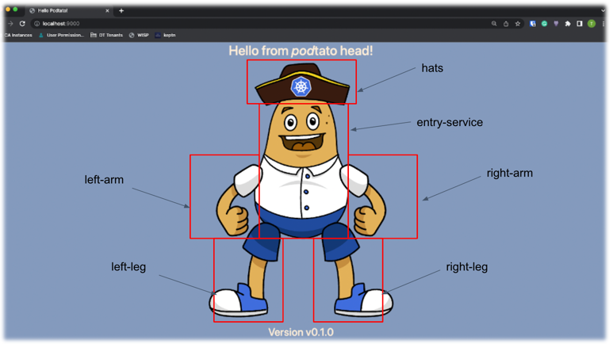

This page gives instructions for installing the Keptn Lifecycle Toolkit
and running a simple Keptn application to familiarize yourself
with how the Keptn Lifecycle Toolkit works.

You will learn how to do the following:

* Use the Keptn Lifecycle Toolkit to control the deployment of your application
* Connect the lifecycle-toolkit to Prometheus
* Use pre-deployment tasks to check if a dependency is met before deploying a workload
* Use post-deployment tasks on an application level to send a notification

## Prerequisites

You need the following to complete this exercise:

* A Kubernetes cluster >= Kubernetes 1.24
  * If you don't have one, we recommend
      [Kubernetes-in-Docker(KinD)](https://kind.sigs.k8s.io/docs/user/quick-start/)
      to set up your local development environment

* kubectl installed on your system
  * See (<https://kubernetes.io/docs/tasks/tools/>) for more information

## Check Kubernetes Version

Run the following and ensure that both client and server versions
are running Kubernetes versions greater than or equal to v1.24.

```shell
kubectl version --short
```

The output should look like this.
In this example, both client and server are at v1.24.0
so the Keptn Lifecycle Toolkit will work.

{}

{}

## Check out the Getting Started Repository

This exercise uses a sample application and some helpers
that make it easier for you to set up your environment.
These can be found in our Getting Started repository.
Use the following command to check out this repository:

For the further progress of this guide,
we need a sample application as well as some helpers
which make it easier foryour to set up your environment.
These things can be found in our Getting Started repository
which can be checked out as follows:

```shell
git clone https://github.com/keptn-sandbox/lifecycle-toolkit-examples.git
cd lifecycle-toolkit-examples
```

## Install the required observability features

The Keptn Lifecycle Toolkit emits OpenTelemetry data as standard
but the toolkit does not come pre-bundled with Observability backend tooling.
This is deliberate as it provides flexibility
for you to bring your own Observability backend
that consumes this emitted data.

In order to use the observability features of the lifecycle toolkit,
we need a monitoring and tracing backend.

In this guide, we use:

* [Prometheus](https://prometheus.io/) for Metrics
* [Jaeger](https://jaegertracing.io) for Traces
* [Grafana](https://github.com/grafana/) for Dashboarding

Install these with the following commands:

```shell
make install-observability
make restart-lifecycle-toolkit
```

> **Note**
To export traces to the OpenTelemetry Collector, you need a
 [KeptnConfig Resource](https://github.com/keptn/lifecycle-toolkit/blob/main/examples/support/keptn/keptnconfig.yaml)
 in the namespace where KLT is installed.

## The Demo Application

For this demonstration, we use a slightly modified version of
[the PodTatoHead](https://github.com/podtato-head/podtato-head) application.

<!-- markdown-link-check-disable-next-line -->


Over time, we will evolve this application
from a simple manifest to a Keptn-managed application:

* We install it with **kubectl**
  then add pre- and post-deployment tasks.
  * For this, we check if the entry service is available
    before the other services are scheduled.
* We then add evaluations to ensure
    that our infrastructure is in good shape before we deploy the application.
* Finally, we evolve to a GitOps driven deployment
  and notify an external webhook service when the deployment has finished.

## Install the Demo Application (Version 1)

In the first version of the Demo application,
the Keptn Lifecycle Toolkit evaluates metrics provided by Prometheus
and checks if the specified amount of CPUs are available
before deploying the application

To install it, simply apply the manifest:

```shell
make deploy-version-1
```

You can watch the progress of the deployment as follows:

### Watch workload state

When the Lifecycle Toolkit detects workload labels
("app.kubernetes.io/name" or "keptn.sh/workload") on a resource,
a KeptnWorkloadInstance (kwi) resource is created.
Using this resource you can watch the progress of the deployment.

```shell
kubectl get keptnworkloadinstances -n podtato-kubectl
```

This shows the current status of the Workloads
and in which phase they are at the moment.
You can get more detailed information about the workloads
by describing one of the resources:

```shell
kubectl describe keptnworkloadinstances podtato-head-podtato-head-entry -n podtato-kubectl
```

> **Note**
The event stream of the object contains more detailed information

<details>
<summary>Watch application state</summary>
Although you didn't specify an application in your manifest,
the Lifecycle Toolkit assumes that this is a single-service application
and creates an ApplicationVersion (kav) resource for you.

Using `kubectl get keptnappversions -n podtato-kubectl`,
you can see the state of these resources.
</details>

<details>
<summary>Watch pods</summary>
Obviously, you should see that the pods are starting normally.
You can watch the state of the pods using:

```shell
kubectl get pods -n podtato-kubectl
```

Furthermore, you can port-forward the podtato-head service
to your local machine and access the application via your browser:

```shell
make port-forward-grafana
```

In your browser (<http://localhost:3000>),
log in with the user `admin` and the password `admin`).
You can open the Dashboard `Keptn Applications`
and see the current state of the application,
which should be similar to the following:

<!-- markdown-link-check-disable-next-line -->


In this screen you get the following information:

* Successful/Failed Deployments
* Time between Deployments
* Deployment Time per Version
* The link to the Trace of the deployment

After some time (~60 seconds),
you should see one more failed deployment in your dashboard.
You can click on the link to the trace and see the reason for the failure:

<!-- markdown-link-check-disable-next-line -->


In this case, we see the name of the failed pre-deployment evaluation
and the reason for the failure.
In this case, the minimum amount of CPUs is not met.
This is a problem we can solve by changing the threshold in the evaluation file.

## Install the Demo Application (Version 2)

To achieve this, we changed the operator in the evaluation file
(sample-app/version-2/app-pre-deploy-eval) from `<` to `>`
and applied the new manifest:

```shell
kubectl apply -f sample-app/version-2
```

After this, you can inspect the new state of the application
using the same commands as before.
You should see that the deployment is now successful
and that the trace is also updated.
You should also see in the Grafana Dashboards
that the deployment was successful.

Congratulations!
You have successfully deployed an application
using the Keptn Lifecycle Toolkit!
