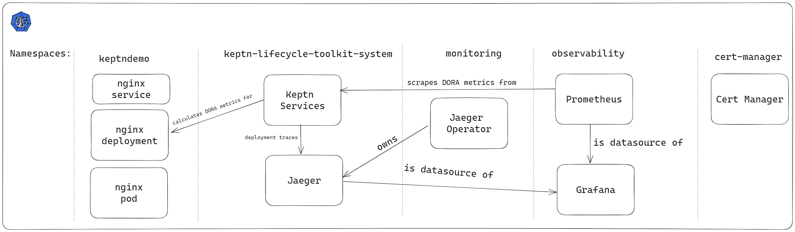

Keptn Lifecycle Toolkit works whether or not you use a GitOps strategy. The following is an imperative walkthrough.

If you prefer a GitOps / declarative-based approach follow [this demo instead](https://example.com).

## Prerequisites
- A Kubernetes cluster (we recommend [Kubernetes kind](https://kind.sigs.k8s.io/docs/user/quick-start/))
- [Helm](https://helm.io) CLI available

## Objectives
- Install Keptn Lifecycle Toolkit on your cluster
- Annotate a namespace and deployment to enable Keptn Lifecycle Toolkit
- View DORA Metrics
- Install Grafana and Observability tooling to view DORA metrics

## System Overview
By the end of this page, here is what will be built. This system will be built in stages.



## Step 1: Install Keptn Lifecycle Toolkit

Install Keptn Lifecycle Toolkit using Helm:

```shell
helm repo add klt https://charts.lifecycle.keptn.sh
helm repo update
helm upgrade --install keptn klt/klt -n keptn-lifecycle-toolkit-system --create-namespace --wait
```

## Create Namespace for Demo Application

Save this file as `namespace.yaml`. The annotation means that Keptn Lifecycle Toolkit is active for workloads in this namespace.

```yaml
apiVersion: v1
kind: Namespace
metadata:
  name: keptndemo
  annotations:
    keptn.sh/lifecycle-toolkit: enabled
```

Create the namespace:

```shell
kubectl apply -f namespace.yaml
```

## Deploy Demo Application

It is time to deploy the demo application.

Save this manifest as `app.yaml`:

```shell
apiVersion: apps/v1
kind: Deployment
metadata:
  name: nginx-deployment
  namespace: keptndemo
  labels:
    app.kubernetes.io/name: nginx
spec:
  replicas: 1
  selector:
    matchLabels:
      app.kubernetes.io/name: nginx
  template:
    metadata:
      labels:
        app.kubernetes.io/part-of: keptndemoapp
        app.kubernetes.io/name: nginx
        app.kubernetes.io/version: 0.0.1
    spec:
      containers:
      - name: nginx
        image: nginx:1.14.2
        ports:
        - containerPort: 80
---
apiVersion: apps/v1
kind: Service
apiVersion: v1
kind: Service
metadata:
  name: nginx
spec:
  selector:
    app.kubernetes.io/name: nginx
  ports:
    - protocol: TCP
      port: 8080
      targetPort: 80
```

Now apply:

```shell
kubectl apply -f app.yaml
```

## Explore Keptn

Keptn is now aware of your deployments and is generating DORA statistics about them.

Keptn has created a CRD to track your application. The name of which is based on the `part-of` label.

```shell
kubectl -n keptndemo get keptnapp
```

Keptn also creates a new application version every time you increment the `version` label:

```shell
kubectl -n keptndemo get keptnappversion
```

Keptn can run tasks and SLO evaluations before and after deployment. You haven't configured this yet, but you can see the full lifecycle for a `keptnappversion` by running:

```shell
kubectl -n keptndemo get keptnappversion -o wide
```

The pod will be running when the `PHASE` is `Completed`.

Keptn applications are a collection of workloads. By default, Keptn will build `KeptnApp` CRDs based on the labels you provide.

In the example above, the `KeptnApp` called `keptndemoapp` contains one workload (based on the `name` label):

## View your application

Port-forward to expose your app on `http://localhost:8080`:

```shell
kubectl -n keptndemo port-forward svc/nginx 8080
```

You should see the "Welcome to nginx" page.

## View DORA Metrics

Keptn is generating DORA metrics and OpenTelemetry traces for your deployments.

These metrics are exposed via the Keptn lifecycle operator `/metrics` endpoint on port `2222`.

To see these raw metrics, port-forward to the name of your service:

```shell
kubectl -n keptn-lifecycle-toolkit-system port-forward service/keptn-klt-lifecycle-operator-metrics-service 2222
```

Access metrics in Prometheus format on `http://localhost:2222/metrics`. Look for metrics starting with `keptn_`.

## View DORA metrics in a better way

It is much more user friendly to provide dashboards for metrics, logs and traces. So let's install new Observability components to help us:

- Cert manager: Jaeger requires cert-manager
- Jaeger: Store and view DORA deployment traces
- Prometheus: Store DORA metrics
- OpenTelemetry collector: Scrape metrics from the above DORA metrics endpoint.Forward this data to Prometheus
- Grafana (and some prebuilt dashboards): Visualise the data

### Install Cert-Manager

```shell
kubectl apply -f https://github.com/cert-manager/cert-manager/releases/download/v1.12.2/cert-manager.crds.yaml
helm repo add jetstack https://charts.jetstack.io
helm repo update
helm install cert-manager --namespace cert-manager --version v1.12.2 jetstack/cert-manager --create-namespace --wait
```
### Install Jaeger

Save this file as `jaeger.yaml`:

```shell
apiVersion: jaegertracing.io/v1
kind: Jaeger
metadata:
  name: jaeger
spec:
  strategy: allInOne
```

Install Jaeger to store and visualise the deployment traces generated by Keptn:

```shell
kubectl create namespace observability
kubectl apply -f https://github.com/jaegertracing/jaeger-operator/releases/download/v1.46.0/jaeger-operator.yaml -n observability
kubectl wait --for=condition=available deployment/jaeger-operator -n observability --timeout=300s
kubectl apply -f jaeger.yaml -n keptn-lifecycle-toolkit-system
kubectl wait --for=condition=available deployment/jaeger -n keptn-lifecycle-toolkit-system --timeout=300s
```

Port-forward to access Jaeger:

```shell
kubectl -n keptn-lifecycle-toolkit-system port-forward svc/jaeger-query 16686
```

Jaeger is available on `http://localhost:16686`

### Install Grafana dashboards

```shell
kubectl create ns monitoring
kubectl apply -f https://raw.githubusercontent.com/keptn/lifecycle-toolkit/main/examples/support/observability/config/prometheus/grafana-config.yaml
kubectl apply -f https://raw.githubusercontent.com/keptn/lifecycle-toolkit/main/examples/support/observability/config/prometheus/grafana-dashboard-keptn-applications.yaml
kubectl -n monitoring label cm/grafana-dashboard-keptn-applications grafana_dashboard="1"
kubectl apply -f https://raw.githubusercontent.com/keptn/lifecycle-toolkit/main/examples/support/observability/config/prometheus/grafana-dashboard-keptn-overview.yaml
kubectl -n monitoring label cm/grafana-dashboard-keptn-overview grafana_dashboard="1"
kubectl apply -f https://raw.githubusercontent.com/keptn/lifecycle-toolkit/main/examples/support/observability/config/prometheus/grafana-dashboard-keptn-workloads.yaml
kubectl -n monitoring label cm/grafana-dashboard-keptn-workloads grafana_dashboard="1"
```

### Install Grafana datasources

This file will configure Grafana to look at the Jaeger service and the Prometheus service on the cluster.

Save this file as `datasources.yaml`:

```yaml
apiVersion: v1
kind: Secret
type: Opaque
metadata:
  labels:
    grafana_datasource: "1"
  name: grafana-datasources
  namespace: monitoring
stringData:
  datasources.yaml: |-
    {
        "apiVersion": 1,
        "datasources": [
            {
                "access": "proxy",
                "editable": false,
                "name": "prometheus",
                "orgId": 1,
                "type": "prometheus",
                "url": "http://observability-stack-kube-p-prometheus.monitoring.svc:9090",
                "version": 1
            },
            {
                "orgId":1,
                "name":"Jaeger",
                "type":"jaeger",
                "typeName":"Jaeger",
                "typeLogoUrl":"public/app/plugins/datasource/jaeger/img/jaeger_logo.svg",
                "access":"proxy",
                "url":"http://jaeger-query.keptn-lifecycle-toolkit-system.svc.cluster.local:16686",
                "user":"",
                "database":"",
                "basicAuth":false,
                "isDefault":false,
                "jsonData":{"spanBar":{"type":"None"}},
                "readOnly":false
            }
        ]
    }
```

Now apply it:

```shell
kubectl apply -f datasources.yaml
```

### Install Kube-Prometheus Stack

This will install:

- Prometheus
- Prometheus Configuration
- Grafana & default dashboards

Save this file as `values.yaml`:

```yaml
grafana:
  adminPassword: admin
  sidecar.datasources.defaultDatasourceEnabled: false
prometheus:
  additionalScrapeConfigs:
    - job_name: "scrape_klt"
      scrape_interval: 5s
      static_configs:
        - targets: ['keptn-klt-lifecycle-operator-metrics-service.keptn-lifecycle-toolkit-system.svc.cluster.local:2222']
```
```shell
helm repo add prometheus-community https://prometheus-community.github.io/helm-charts
helm repo update
helm upgrade --install observability-stack prometheus-community/kube-prometheus-stack --version 48.1.1 --namespace monitoring --values=values.yaml --wait
```

### Install OpenTelemetry Collector

This OpenTelemetry collector will scrape the metrics from KLT every 5 seconds and forward them to Prometheus.

Save this file as **collector.yaml**:

```yaml
apiVersion: v1
kind: ConfigMap
metadata:
  name: otel-collector-conf
  namespace: keptn-lifecycle-toolkit-system
  labels:
    app: opentelemetry
    component: otel-collector-conf
data:
  otel-collector-config: |
    receivers:
      # Make sure to add the otlp receiver.
      # This will open up the receiver on port 4317
      otlp:
        protocols:
          grpc:
            endpoint: "0.0.0.0:4317"
      prometheus:
        config:
          scrape_configs:
            - job_name: 'otel-collector'
              scrape_interval: 5s
              static_configs:
                - targets: ['keptn-klt-lifecycle-operator-metrics-service:2222']
    processors:
    extensions:
      health_check: {}
    exporters:
      prometheus:
        endpoint: 0.0.0.0:8889
      logging:

    service:
      extensions: [health_check]
      pipelines:
        metrics:
          receivers: [otlp,prometheus]
          processors: []
          exporters: [prometheus, logging]
---
apiVersion: v1
kind: Service
metadata:
  name: otel-collector
  namespace: keptn-lifecycle-toolkit-system
  labels:
    app: opentelemetry
    component: otel-collector
spec:
  ports:
    - name: otlp # Default endpoint for otlp receiver.
      port: 4317
      protocol: TCP
      targetPort: 4317
      nodePort: 30080
    - name: metrics # Default endpoint for metrics.
      port: 8889
      protocol: TCP
      targetPort: 8889
  selector:
    component: otel-collector
  type: NodePort
---
apiVersion: apps/v1
kind: Deployment
metadata:
  name: otel-collector
  namespace: keptn-lifecycle-toolkit-system
  labels:
    app: opentelemetry
    component: otel-collector
spec:
  selector:
    matchLabels:
      app: opentelemetry
      component: otel-collector
  minReadySeconds: 5
  progressDeadlineSeconds: 120
  replicas: 1
  template:
    metadata:
      annotations:
        prometheus.io/path: "/metrics"
        prometheus.io/port: "8889"
        prometheus.io/scrape: "true"
      labels:
        app: opentelemetry
        component: otel-collector
    spec:
      containers:
        - command:
            - "/otelcol"
            - "--config=/conf/otel-collector-config.yaml"
          env:
            - name: GOGC
              value: "80"
          image: otel/opentelemetry-collector:0.81.0
          name: otel-collector
          resources:
            limits:
              cpu: 400m
              memory: 1Gi
            requests:
              cpu: 10m
              memory: 20Mi
          ports:
            - containerPort: 4317 # Default endpoint for otlp receiver.
            - containerPort: 8889 # Default endpoint for querying metrics.
          volumeMounts:
            - name: otel-collector-config-vol
              mountPath: /conf
          livenessProbe:
            httpGet:
              path: /
              port: 13133 # Health Check extension default port.
          readinessProbe:
            httpGet:
              path: /
              port: 13133 # Health Check extension default port.
      volumes:
        - configMap:
            name: otel-collector-conf
            items:
              - key: otel-collector-config
                path: otel-collector-config.yaml
          name: otel-collector-config-vol
---
apiVersion: monitoring.coreos.com/v1
kind: ServiceMonitor
metadata:
  labels:
    serviceapp: otel-collector
  name: otel-collector
  namespace: keptn-lifecycle-toolkit-system
spec:
  endpoints:
    - bearerTokenFile: /var/run/secrets/kubernetes.io/serviceaccount/token
      interval: 30s
      port: metrics
  namespaceSelector:
    matchNames:
      - keptn-lifecycle-toolkit-system
  selector:
    matchLabels:
      app: opentelemetry
```

Now apply it:

```shell
kubectl apply -f collector.yaml
```

## Access Grafana

```shell
kubectl -n monitoring port-forward svc/observability-stack-grafana 80
```

Grafana is now available on: `http://localhost`

- Grafana username: `admin`
- Grafana password: `admin`

# TODO
1. Understand why Grafana datasources are not set