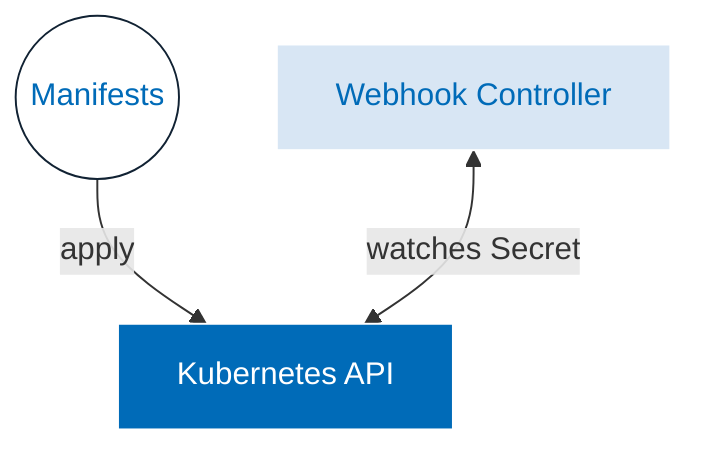

# Keptn Cert Manager

The Keptn Cert Manager is a Kubernetes operator that
automatically configures TLS certificates to
[secure communication with the Kubernetes API](https://kubernetes.io/docs/concepts/security/controlling-access/#transport-security).

Keptn includes mutating, validating and conversion Webhooks
that require TLS certificates to be mounted as a volume.
These webhooks and CRDs contain a `keptn.sh/inject-cert: "true"` label indicating that
these resources require a TLS certificate.

How it works:

* Keptn Cert Manager looks for the resources with `keptn.sh/inject-cert: "true"` label.
* It creates a [secret](https://kubernetes.io/docs/concepts/configuration/secret/)
(if it does not exist yet) with a TLS certificate in the
Keptn installation namespace and mounts this Secret as a volume to the labelled resource.
* The TLS certificate stored in the Secret has an expiration time of 12 hours and is
automatically renewed.

If you don't want to use Keptn Cert Manager, you can instead
use [cert-manager.io](../installation/configuration/cert-manager.md)
for this purpose.

## Troubleshooting

When experiencing problems with setting up cert-manager.io,
please refer to the
[cert-manager.io troubleshooting page](https://cert-manager.io/docs/troubleshooting/).
