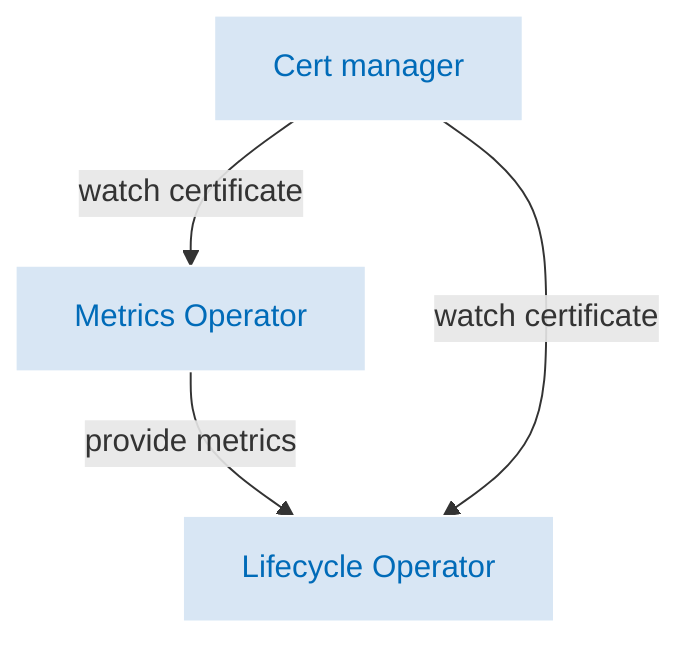

# Components

## Keptn Components

Keptn consists of the following main components:

* [Keptn Lifecycle Operator](./lifecycle-operator/index.md)
* [Keptn Metrics Operator](./metrics-operator.md)
* [Keptn Scheduler](./scheduling.md)
* [Keptn Certificate Manager](./certificate-operator.md)

The architectural diagram:

