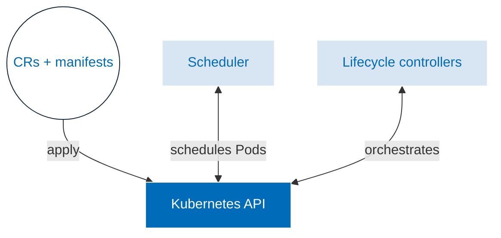

# Keptn Lifecycle Operator

**Keptn's Lifecycle Operator** is
a Kubernetes [operator](https://kubernetes.io/docs/concepts/extend-kubernetes/operator/)
that automates the deployment and management
of the Keptn components in a Kubernetes cluster.
It plays a crucial role in managing and orchestrating
the various stages of application lifecycle management within
Keptn.

The lifecycle operator acts as the backbone of Keptn, overseeing the entire application lifecycle from deployment
to testing, evaluation, and observability.
It facilitates a streamlined and automated approach to managing the evolution of applications, ensuring smooth
transitions between different stages such as development, testing, staging, and production.

Key responsibilities of the lifecycle operator include:

1. **Automated Deployment:** It automates the deployment of applications using various deployment strategies,
such as blue-green deployments or canary releases, ensuring seamless rollouts without disrupting the user experience.

2. **Continuous Testing:** The operator integrates testing mechanisms throughout the lifecycle, enabling continuous
validation of application changes.
It runs automated tests, assesses performance, and ensures the application meets predefined quality gates
before moving to the next stage.

3. **Evaluation and Feedback:** It collects metrics and evaluates the performance of deployed applications
against predefined Service Level Objectives (SLOs) and Service Level Indicators (SLIs).
It analyzes this data to provide feedback and insights into the application's health and performance.

4. **Observability:** It provides observability of the running application out-of-the-box by exposing metrics,
traces and logs.

5. **State Management and Versioning:** It manages the state and versioning of applications, keeping track of
different versions deployed across various environments and ensuring consistency in the deployment process.

Overall, the lifecycle operator in Keptn acts as an intelligent control system, orchestrating the flow of
changes and ensuring the reliability, quality, and agility of applications throughout their lifecycle in
a cloud-native environment.
It empowers development teams to focus on innovation by automating repetitive tasks and providing a
standardized, efficient approach to managing complex application lifecycle.
