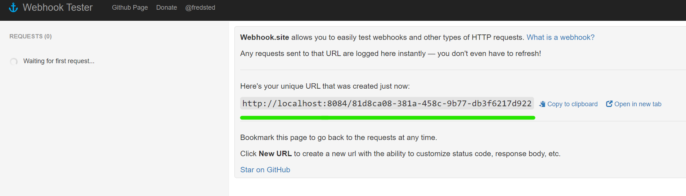

# Release Lifecycle Management

The Release Lifecycle Management tools run
pre/post-deployment tasks and evaluations
as well as promotion tasks
for your existing cloud-native deployments
to make them more robust.
For more information, see
[Release lifecycle management](../core-concepts/index.md#release-lifecycle-management).

This tutorial introduces these tools.

> This tutorial assumes you have already completed the
[Getting started with Keptn Observability](observability.md)
exercise.
> Please ensure you've finished that before attempting this exercise.

## Keptn Pre and Post Deployment Tasks

When Keptn is successfully monitoring your deployments,
it can also run arbitrary tasks and SLO evaluations for you
either before or after your deployment runs.
This is specified with labels or annotations in the Pod template specs of your
[workloads](https://kubernetes.io/docs/concepts/workloads/)
([Deployments](https://kubernetes.io/docs/concepts/workloads/controllers/deployment/),
[StatefulSets](https://kubernetes.io/docs/concepts/workloads/controllers/statefulset/),
[DaemonSets](https://kubernetes.io/docs/concepts/workloads/controllers/daemonset/),
and
[ReplicaSets](https://kubernetes.io/docs/concepts/workloads/controllers/replicaset/)).

> Pre and post deployments can be run either on individual workloads
> or on a group of associated workloads that are grouped into
> a `KeptnApp` resource.
> For instructions about how to identify the workloads to combine into  `KeptnApp` resource,
> see
> [annotations to KeptnApp](../guides/integrate.md#basic-annotations).
> [Auto app discovery](../guides/auto-app-discovery.md/)
> explains how a `KeptnApp` resource is created.

## Prerequisites: Deploy webhook sink

During this exercise, you will configure Keptn to trigger a webhook
before and after a deployment has completed successfully.

For demo purposes, a place is required to which those requests are sent.
To implement this:

1. Install the
   [open source webhook.site tool](https://github.com/webhooksite/webhook.site/tree/master/kubernetes).

     This provides a place on your cluster to which web requests are sent
     and from which they can be viewed.
     If you have your own endpoint, you can skip this step.

1. Execute the following commands to apply the web hook:

     ```shell
     kubectl apply -f https://raw.githubusercontent.com/webhooksite/webhook.site/master/kubernetes/namespace.yml
     kubectl apply -f https://raw.githubusercontent.com/webhooksite/webhook.site/master/kubernetes/redis.deployment.yml
     kubectl apply -f https://raw.githubusercontent.com/webhooksite/webhook.site/master/kubernetes/laravel-echo-server.deployment.yml
     kubectl apply -f https://raw.githubusercontent.com/webhooksite/webhook.site/master/kubernetes/webhook.deployment.yml
     kubectl apply -f https://raw.githubusercontent.com/webhooksite/webhook.site/master/kubernetes/service.yml
     ```

1. Wait until all Pods are running in the `webhook` namespace
   then port-forward and view the webhook sink page:

     ```shell
     kubectl -n webhook wait --for=condition=Ready pods --all
     kubectl -n webhook port-forward svc/webhook 8084
     ```

1. Open a browser and go to `http://localhost:8084`

1. You should see a page like this with a unique URL
   (your ID will be different than the example).

     

1. Make a note of that unique URL.

### Verify Webhook Sink

Open a new browser table and go to your unique URL.
The page should remain blank, but when toggling back to `http://localhost:8084`, you should see a new entry.

Each request sent to that unique URL will be logged here.


## Add a Post Deployment Task

Add a task that triggers after a successful deployment.

Change `UUID` to whatever value you have.
Apply this manifest:

```yaml

```

### Verify it works

Verify that the `KeptnTaskDefinition` resource shown above actually works.

Trigger an on-demand task execution
to verify that the job and Pod are working correctly.

In the following steps we have Keptn orchestrate this for us automatically.

Apply this manifest:

```yaml

```

If it works, `kubectl -n keptndemo get jobs` should show:

```shell
NAME                  COMPLETIONS   DURATION   AGE
runsendevent1-*****   1/1           6s         2m
```

`kubectl -n keptndemo get pods` shows the successfully executed Pod.

The webhook sync should show this:


Incidentally, this is exactly how you can use Keptn with
[applications deployed outside of Kubernetes](../use-cases/non-k8s.md).

> Note: If you want to trigger this task multiple times,
> you must change the value of the `name` field
> in the `KeptnTask` resource each time.
> For example, change `runsendevent1` to `runsendevent2`.
> See
> [Redeploy/Restart an Application](../guides/restart-application-deployment.md/)
> for details.
>

## Ask Keptn to trigger task after Deployment

Annotate the demo application `Deployment` manifest
to have Keptn automatically trigger the task after every deployment.

Recall the `Deployment` from the
[Observability](../getting-started/observability.md#step-3-deploy-demo-application)
Getting started guide.

Add a new label so the `labels` section looks like this:

```yaml

```

Increase the version number to `0.0.2` and re-apply the manifest.

Here is a full version of the new YAML:

```yaml

```

> Best Practice: Start with post deployment tasks.
> Pre-deployment tasks can potentially block deployments (see below).

### What Happens Next?

1. The deployment is applied.
1. When the Pods are running,
   Keptn automatically creates a `KeptnTask` resource
   for version `0.0.2` of this `KeptnApp`.
1. The `KeptnTask` creates a Kubernetes `Job`.
1. The Kubernetes `Job` creates a Kubernetes `Pod`.
1. The `Pod` runs `curl` and sends a new event to the event sink.

### Pre-deployment Tasks

Keptn Tasks can also be executed pre-deployment (before the Pods are scheduled).
Do this by using the `keptn.sh/pre-deployment-tasks` label or annotation.

> Note: If a pre-deployment task fails, by default, the `Pod` remains in a Pending state.

## More control over the application

To customize checks associated with the application, we can create a `KeptnAppContext` resource and define
a set of pre/post deployment tasks or evaluations as well as promotion tasks for the whole application.
Note that the name of the `KeptnAppContext` resource needs to match the name of the automatically
created `KeptnApp` and the value present in the `keptn.sh/app` or `app.kubernetes.io/part-of`
annotations.
In this case it needs to be `keptndemoapp`.

The `KeptnAppContext` also includes `promotionTasks`.
These are executed after the Deployment and all pre/post-deployment
tasks and evaluations are executed successfully.
They should serve only one purpose - to promote the application to another stage
(for example from `dev` to `prod`).
A promotion task is defined in a `KeptnTaskDefinition` resource:

```yaml

```

An example of `KeptnAppContext` executing post-deployment task `send-event` and
promotion task `promotion`:

```yaml

```

This way, the `send-event` task is executed after the deployment of the whole application;
in other words, after all of the workloads present in the `KeptnApp`
are in a `Running` state.
After the `send-event` task succeeds, `promotion` task are executed.

A detailed description of all the available fields of the `KeptnAppContext` resource can be found in the
[KeptnAppContext CRD reference page](../reference/crd-reference/appcontext.md).

> **Note**
You must have the `promotion` feature enabled in order to execute promotion tasks.
You can enable it via `lifecycleOperator.promotionTasksEnabled` helm value during installation of Keptn.
More information can be found
[here](https://github.com/keptn/lifecycle-toolkit-charts/tree/main/charts/keptn-lifecycle-operator#global).

## Further Information

You can do much more with `KeptnTask` resources.
See the
[Deployment tasks](../guides/tasks.md)
page to find out more.

To learn more about making pre-task and pre-evaluations non-blocking
please see the
[Keptn non-blocking deployment section](../components/lifecycle-operator/keptn-non-blocking.md).

## What's next?

Keptn can also run simple pre- and post-deployment SLO evaluations.

Continue the Keptn learning journey by adding evaluations.
See the
[Evaluations](../guides/evaluations.md)
for more information.
