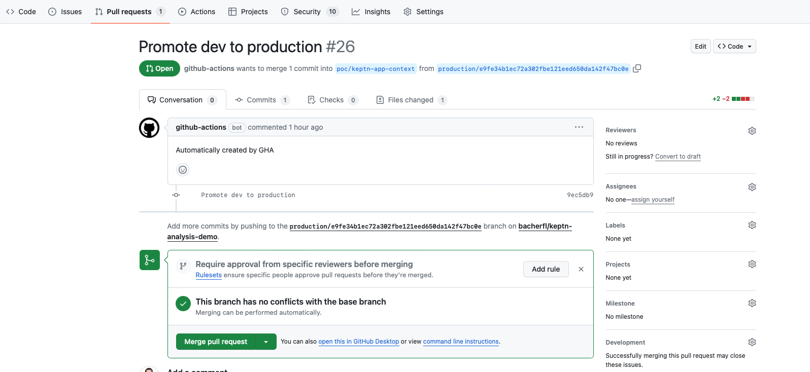
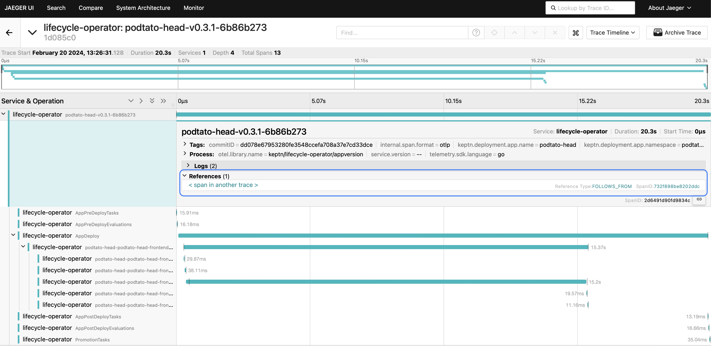

# Multi-stage Delivery using GitOps

In this guide you will learn how to deploy
an application across multiple stages while getting
full observability of each of your workload deployments.
This is shown based on an example where we deploy
an application into two environments (`dev` and `production`),
using [Argo CD](https://argo-cd.readthedocs.io/en/stable/).

The promotion from `dev` to `production` is implemented using
Keptn's `promotionTasks` that can be executed after a successful
application deployment.
In this example, the promotion task creates a pull request
to deploy the same workload version that has been deployed in the
`dev` stage into the `production` stage.
Using Keptn's observability capabilities,
we also add contextual metadata to each deployment,
such as the commit ID which triggered the deployment of a new
version.
This metadata is added to the OpenTelemetry traces
representing the deployment of an application version
in a particular stage.
Also, deployment traces for the `production` stage will
contain references to the deployments of the `dev` stage,
giving you full traceability of a workload version
across different stages.

## Before you begin

This guide assumes the following:

- Installed Keptn with the
[promotionTasksEnabled flag](https://github.com/keptn/lifecycle-toolkit/blob/main/lifecycle-operator/chart/README.md#global)
set to `true`.
- Installed [Argo CD](https://argo-cd.readthedocs.io/en/stable/)
- Followed the [instructions for setting up observability](./otel.md#requirements-for-opentelemetry)
- Access to a GitHub repository for hosting your application manifests.
- A Personal Access token for your GitHub repository.
We recommend using a [fine-grained token](https://docs.github.com/en/authentication/keeping-your-account-and-data-secure/managing-your-personal-access-tokens#fine-grained-personal-access-tokens)
with the following permissions for the repository:
    - Read access to metadata
    - Read/Write access to actions

Note that for the promotion to work properly,
you need to enable read and write permissions for
Github actions in your repository - see the screenshot below:


## Preparing the Application Manifests

In this example, the application will be deployed in
two different namespaces, each representing a different
stage (`dev` and `production`).
To create the namespaces, execute the following commands:

```shell
kubectl create namespace podtato-head-dev
kubectl annotate namespace podtato-head-dev keptn.sh/lifecycle-toolkit=enabled
kubectl create namespace podtato-head-production
kubectl annotate namespace podtato-head-production keptn.sh/lifecycle-toolkit=enabled
```

The promotion task that triggers the action to
create a pull request for promoting an application version
from `dev` to `production` will be executed in the `podtato-head-dev` stage.
Therefore, we need to create a secret containing the GitHub personal
access token in this namespace, using the following command:

```shell
GH_REPO_OWNER=<YOUR_GITHUB_USER>
GH_REPO=<YOUR_GITHUB_REPO>
GH_API_TOKEN=<YOUR_GITHUB_TOKEN>
kubectl create secret generic github-token -n podtato-head-dev --from-literal=SECURE_DATA="{\"githubRepo\":\"${GH_REPO}\",\"githubRepoOwner\":\"${GH_REPO_OWNER}\",\"apiToken\":\"${GH_API_TOKEN}\"}"
```

Next, add the promotion task as a GitHub action by
committing the following file to the repository:

```yaml title=".github/workflows/promote.yaml"

```

Next, add the application manifests to the GitOps repository.
Note that in this example, the manifests for the `dev` and `production`
stage are located in two different subdirectories within
the repository to keep it simple.
This might differ heavily depending on how your organization's
GitOps repositories and application stages are organized.

Inside your git repository, create the following files
containing the manifests for the `dev` and `production` stage:

**Dev Stage:**

=== "dev/templates/application.yaml"

  ```yaml
  
  ```

=== "dev/Chart.yaml"

  ```yaml
  
  ```

=== "dev/values.yaml"

  ```yaml
  
  ```

**Production Stage:**

=== "production/templates/application.yaml"

  ```yaml
  
  ```

=== "production/Chart.yaml"

  ```yaml
  
  ```

=== "production/values.yaml"

  ```yaml
  
  ```

After creating all the files listed above, do not forget to push
them to your git repository:

```shell
git add .
git commit -m "add application manifests"
git push
```

After adding the files to the repository,
it is time to create the Argo CD applications,
one for the `dev` stage, and one for the `production`
stage.
These applications will point to the subdirectories
containing the helm charts for the stages within the upstream
git repository.
To create the applications on Argo CD, apply the following manifests:

```yaml title="apps.yaml"

```

Once the manifest above has been applied to the cluster,
Argo CD will eventually synchronize with the upstream repository
and apply the application helm charts located in the upstream repository.
Note that initially, both the `dev` and `production` stages will be deployed
after creating the Argo CD applications.
Subsequent deployments of a new application version however will
always be deployed by first updating them in the `dev` stage first, and
then only by merging the PRs created by the promotion task will
they be deployed into `production`.

After this initial deployment, there will be a `KeptnAppVersion`
in the `dev` stage:

```shell
$ kubectl get keptnappversion -n podtato-head-dev

NAME                           APPNAME        VERSION   PHASE
podtato-head-v0.3.0-6b86b273   podtato-head   v0.3.0    Completed
```

And there will be another `KeptnAppVersion` in the `production` stage.

```shell
$ kubectl get keptnappversion -n podtato-head-production

NAME                           APPNAME        VERSION   PHASE
podtato-head-v0.3.0-6b86b273   podtato-head   v0.3.0    Completed
```

## Promoting a workload

Now that everything is set up, it is time to deploy a new version into `dev`
and automatically promote it into `production` if the deployment into `dev`
has been successful.
To do so, change the `serviceVersion` value in `dev/values.yaml` from `v0.3.0`
to `v0.3.1`:

```yaml title="dev/values.yaml"

```

After changing the value, commit and push the updated file to
the upstream repository:

```shell
git add dev/values.yaml
git commit -m "deploy new version into dev"
git push
```

Eventually, Argo CD will notify these changes and apply the updated helm chart
to the cluster.
This is also reflected in a new `KeptnAppVersion` being created in the `dev` stage:

```shell
$ kubectl get keptnappversion -n podtato-head-dev
TODO
```

After the new version has been deployed, and the post deployment phase
is completed, the `KeptnTask` executed in the promotion phase
triggers a GitHub action that creates a pull request for applying the
updated values to the helm chart of the `production` stage.
You will see the PR in the *Pull requests* section of your upstream repository:



After approving and merging the pull request into `main`,
Argo CD eventually synchronizes the application in the
`production` stage, and the updated version is deployed.
This is reflected in a new `KeptnAppVersion` being created
in the `podtato-head-production` namespace:

```shell
$ kubectl get keptnappversion -n podtato-head-production

NAME                           APPNAME        VERSION   PHASE
podtato-head-v0.3.0-6b86b273   podtato-head   v0.3.0    Completed
podtato-head-v0.3.1-d4735e3a   podtato-head   v0.3.1    Completed
```

## Inspecting the Deployment Traces

To keep track of how a workload version progresses through
the stages, we passed through the OTel span id of the
promotion phase in the `dev` stage to the applied
`KeptnAppContext` in the `production` stage.
Due to that, the deployment trace of the promoted version
in the `production` stage contains the reference to the
promotion phase, which is also visible in the trace visualization in Jaeger:


