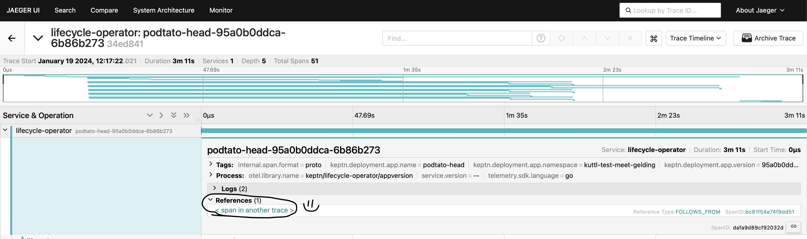

# OpenTelemetry observability

Keptn makes any Kubernetes deployment observable.
In other words, it creates a distributed, end-to-end trace
of what Kubernetes does in the context of a Deployment.
To do this,
Keptn introduces the concept of an `application`,
which is an abstraction that connects multiple
[Workloads](https://kubernetes.io/docs/concepts/workloads/) that logically belong together,
even if they use different deployment strategies.

This means that:

- You can readily see why a deployment takes so long
  or why it fails, even when using multiple deployment strategies.
- Keptn can capture DORA metrics and expose them as OpenTelemetry metrics

The observability data is an amalgamation of the following:

- [DORA metrics](dora.md)
  are collected out of the box when Keptn is enabled
- [OpenTelemetry](https://opentelemetry.io/)
  runs traces that show everything that happens in the Kubernetes cluster
- Custom
  [Keptn metrics](evaluatemetrics.md)
  that you can use to monitor information
  from all the data providers configured in your cluster

All this information can be displayed with dashboard tools
such as Grafana.

For an introduction to using OpenTelemetry with Keptn metrics, see the
[Keptn Observability](../getting-started/observability.md)
getting started guide.

## Requirements for OpenTelemetry

To access OpenTelemetry metrics with Keptn,
you must have the following on your cluster:

- An OpenTelemetry collector.
  See
  [OpenTelemetry Collector](https://opentelemetry.io/docs/collector/)
  for more information.
- A Prometheus Operator.
  See [Prometheus Operator Setup](https://github.com/prometheus-operator/kube-prometheus/blob/main/docs/customizing.md).

    - The Prometheus Operator must have the required permissions
      to watch resources of your Keptn namespace
      (default is `keptn-system`).
      See
      [Setup for Monitoring other Namespaces](https://prometheus-operator.dev/docs/kube/monitoring-other-namespaces/).

- To install Prometheus into the `monitoring` namespace
  using the example configuration included with Keptn,
  use the following command sequence.
  You can modify these commands to define a different configuration:

    > **Note**
    You must clone the `lifecycle-toolkit` repository
    and `cd` into the correct directory
    (`examples/support/observability`) before running the following commands.

    ```shell
    kubectl create namespace monitoring
    kubectl apply --server-side -f config/prometheus/setup/
    kubectl apply -f config/prometheus/
    ```

- If you want a dashboard for reviewing metrics and traces:

    - Install
      [Grafana](https://grafana.com/grafana/)
      or the visualization tool of your choice, following the instructions in
      [Grafana Setup](https://grafana.com/docs/grafana/latest/setup-grafana/).
    - Install
      [Jaeger](https://www.jaegertracing.io/)
      or a similar tool for traces following the instructions in
      [Jaeger Setup](https://www.jaegertracing.io/docs/1.50/getting-started/).

    - Follow the instructions in the Grafana
      [README](https://github.com/keptn/lifecycle-toolkit/blob/main/dashboards/grafana/README.md)
      file to configure the Grafana dashboard(s) for Keptn.

Metrics can also be retrieved without a dashboard.
See
[Accessing Metrics via the Kubernetes Custom Metrics API](evaluatemetrics.md/#accessing-metrics-via-the-kubernetes-custom-metrics-api)

## Integrate OpenTelemetry into Keptn

To integrate OpenTelemetry into Keptn:

- Apply
  [basic annotations](./integrate.md#basic-annotations)
  for the `Deployment` resource(s)
  to integrate Keptn into your Kubernetes cluster.
- To expose OpenTelemetry metrics,
  define a [KeptnConfig](../reference/crd-reference/config.md) resource
  that has the `spec.OTelCollectorUrl` field populated
  with the URL of the OpenTelemetry collector.

The
[otel-collector.yaml](https://github.com/keptn/lifecycle-toolkit/blob/main/examples/support/observability/config/otel-collector.yaml)
is the OpenTelemetry manifest file for the PodtatoHead example,
located in the `config` directory.
To deploy and configure the OpenTelemetry collector
using this manifest, the command is:

```shell
kubectl apply -f config/otel-collector.yaml \
    -n keptn-system
```

Use the following command to confirm that the pod
for the `otel-collector` deployment is up and running:

```shell
$ kubectl get pods -lapp=opentelemetry \
    -n keptn-system

NAME                              READY   STATUS    RESTARTS      AGE
otel-collector-6fc4cc84d6-7hnvp   1/1     Running   0             92m
```

If you want to extend the OTel Collector configuration
to send your telemetry data to other Observability platform,
you can edit the Collector `ConfigMap` with the following command:

```shell
kubectl edit configmap otel-collector-conf \
    -n keptn-system
```

When the `otel-collector` pod is up and running,
restart the `keptn-scheduler` (if installed) and `lifecycle-operator`
so they can pick up the new configuration:

```shell
kubectl rollout restart deployment \
    -n keptn-system keptn-scheduler lifecycle-operator
```

Keptn begins to collect OpenTelemetry metrics
as soon as the `Deployment` resource
has the basic annotations to integrate Keptn in the cluster.

## Access Keptn metrics as OpenTelemetry metrics

Keptn metrics can be exposed as OpenTelemetry (OTel) metrics
via port `9999` of the Keptn metrics-operator.

To access the metrics, use the following command:

```shell
kubectl port-forward deployment/metrics-operator 9999 -n keptn-system
```

You can access the metrics from your browser at: `http://localhost:9999`

## Define timeout for workload observability

There are situations when the deployment of the application fails due to
various reasons (e.g. container image not found).
By default Keptn observes the state of the Kubernetes workloads
for 5 minutes.
After this timeout is exceeded, the deployment phase (from Keptn
viewpoint) is considered as `Failed` and Keptn does not proceed
with post-deployment phases (tasks, evaluations or promotion phase).
This timeout can be modified for the cluster by changing the value
of the `observabilityTimeout` field in the
[KeptnConfig](../reference/crd-reference/config.md)
resource.

## Advanced tracing configurations in Keptn: Linking traces

In Keptn you can connect multiple traces, for instance to connect deployments
of the same application through different stages.
To create connections between the traces of versions of your application, you can enrich the
[KeptnAppContext](../reference/crd-reference/appcontext.md)
resource with
[OpenTelemetry span links](https://opentelemetry.io/docs/concepts/signals/traces/#span-links).
You can retrieve the span link from the JSON representation of the trace in Jaeger, where
it has the following structure:

```yaml
00-<trace-id>-<span-id>-01
```

Use this value to populate the `spanLinks` field
of your `KeptnAppContext` resource
to connect traces of different versions of the application.

```yaml

```

> **Note**
> The span link used above is just an example.
> You need to replace it with the traceID and spanID
> that you retrieve from the `KeptnAppVersion` resource you want to link.

To store this new information in the traces, you need to increment the version
of your application and apply the`KeptnAppContext`.
Keptn will re-deploy your application and Jaeger should show a link to the previous trace in the references section.


